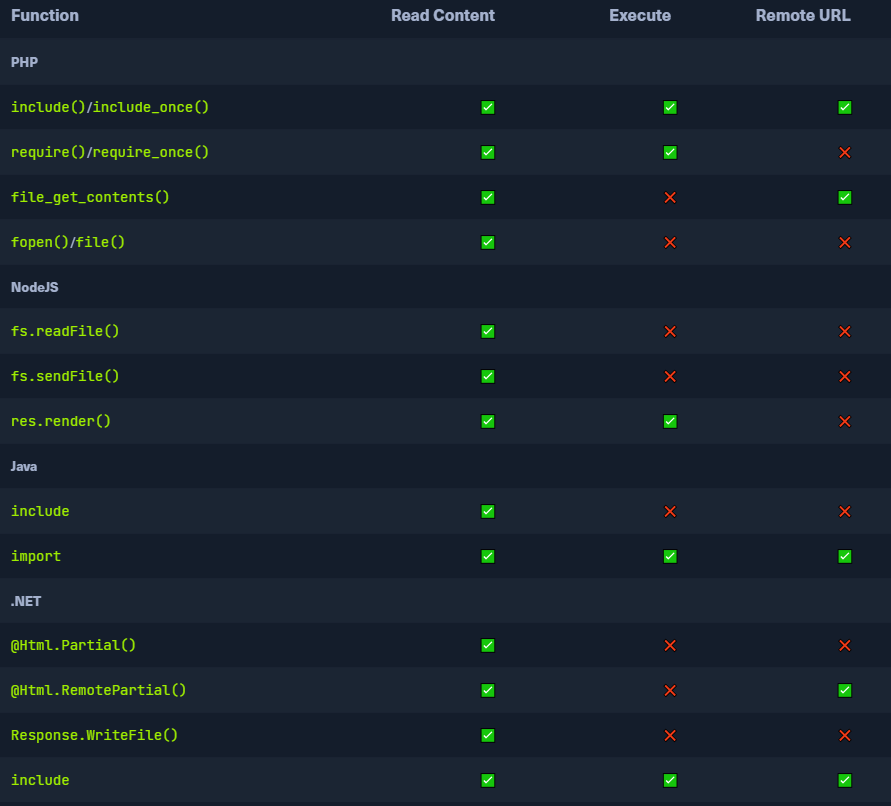

## Local File Inclusion (LFI)
* Most commonly found in templating engines
	* Displays a page that that shows the common static parts e.g `header`, `navigation bar`, and `footer`
	* Dynamically loads other content that changes between pages
	* Often used parameters like `/index.php?page=about`, where `index.php` sets static content (e.g. header/footer), and then only pulls the dynamic content specified in the parameter
		* In this case may be read from a file called `about.php`
	* We have control over the `about` portion of the request
		* May be possible to have the web application grab other files and display them on the page

## Examples of Vulnerable Code
* Can occur in  `PHP`, `NodeJS`, `Java`, `.Net`, and many others
	* Each of them has a slightly different approach to including local files, but they all share one common thing: loading a file from a specified path

#### PHP
* Use `include()` function to load a local or a remote file as we load a page

If the `path` passed to the `include()` is taken from a user-controlled parameter, like a `GET` parameter, and `the code does not explicitly filter and sanitize the user input`, then the code becomes vulnerable to File Inclusion.

**Example**
```php
if (isset($_GET['language'])) {
    include($_GET['language']);
}
```

* `language` parameter is directly passed to the `include()`
* Any path we pass in the `language` parameter will be loaded on the page
* There are also many other functions that do the same thing
	* `include_once()`, `require()`, `require_once()`, `file_get_contents()`

#### NodeJS
* NodeJS web servers may also load content based on an HTTP parameters

**Example**
```javascript
if(req.query.language) {
    fs.readFile(path.join(__dirname, req.query.language), function (err, data){
        res.write(data);
    });
}
```

* Whatever parameter passed from the URL gets used by the `readfile` function
* Then writes the file content in the HTTP response
* Another example is the `render()` function in the `Express.js` framework

**Example**
```js
app.get("/about/:language", function(req, res) {
    res.render(`/${req.params.language}/about.html`);
});
```

* Uses language parameter to determine which directory it should pull the `about.html` page from

Unlike our earlier examples where GET parameters were specified after a (`?`) character in the URL, the above example takes the parameter from the URL path (e.g. `/about/en` or `/about/es`).

#### Java
```js
<c:if test="${not empty param.language}">
    <jsp:include file="<%= request.getParameter('language') %>" />
</c:if>
```

* The `import` function may also be used to render a local file or a URL

```jsp
<c:import url= "<%= request.getParameter('language') %>"/>
```

#### .NET
* The `Response.WriteFile` function works very similarly to all of our earlier examples
* The path may be retrieved from a GET parameter for dynamic content loading

```cs
@if (!string.IsNullOrEmpty(HttpContext.Request.Query['language'])) {
    <% Response.WriteFile("<% HttpContext.Request.Query['language'] %>"); %> 
}
```

* `@Html.Partial()` function may also be used to render the specified file as part of the front-end template, similarly to what we saw earlier

```cs
@Html.Partial(HttpContext.Request.Query['language'])
```

* `include` function may be used to render local files or remote URLs, and may also execute the specified files as well

```cs
<!--#include file="<% HttpContext.Request.Query['language'] %>"-->
```

## Read vs Execute
* Some of the above functions only read the content of the specified files, while others also execute the specified files
* Some of them allow specifying remote URLs, while others only work with files local to the back-end server


