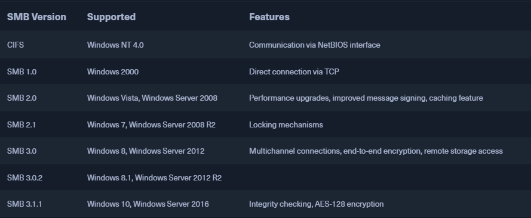
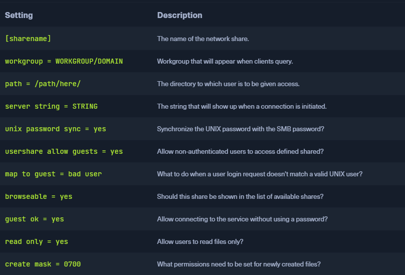
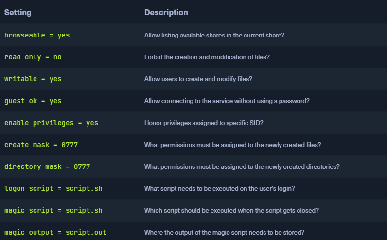
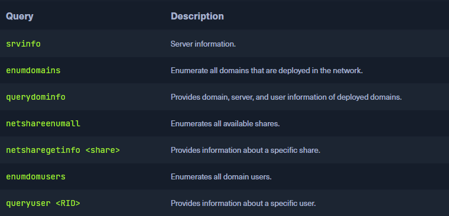

### SMB
* `Server Message Block` (`SMB`)
* Regulates access to files and entire directories and other network resources such as printers, routers, or interfaces released for the network
* Communicate with other participants in the same network to access files or services shared with it on the network

### Samba
* Configuration can be found under `/etc/samba/smb.conf`
* Alternative variant to SMB
* Developed for Unix-base OS's
* Implements  `Common Internet File System` (`CIFS`) network protocol
	* Dialect of SMB
	* Allows Samba to communicate with newer Windows systems
* Usually referred to as `SMB / CIFS`
* Usual SMB Ports `137`, `138`, `139`
	* CIFS uses TCP port `445` only
* Many versions of SMB, including outdated versions that are still used



* With version 3, the Samba server gained the ability to be a full member of an Active Directory domain
* With version 4, Samba even provides an Active Directory domain controller
* SMB server daemon (`smbd`) provides the first two functionalities
* NetBIOS message block daemon (`nmbd`) implements the last two functionalities
* The SMB service controls these two background programs.
* In a network, each host participates in the same `workgroup`
	* Group name that identifies an arbitrary collection of computers and their resources on an SMB network
	* There can be multiple workgroups on the network at any given time
* IBM developed an API for networking computers called `Network Basic Input/Output System` (`NetBIOS`)
	* Provided a blueprint for an application to connect and share data with other computers
	* When a machine goes online in a NetBIOS environment it needs a name
		* Done through the so-called `name registration` procedure
		* Either each host reserves its hostname on the network, or the [NetBIOS Name Server](https://networkencyclopedia.com/netbios-name-server-nbns/) (`NBNS`) is used for this purpose
		*  It also has been enhanced to [Windows Internet Name Service](https://networkencyclopedia.com/windows-internet-name-service-wins/) (`WINS`)

### Default Configuration
```sh
$ cat /etc/samba/smb.conf | grep -v "#\|\;" 

[global]
   workgroup = DEV.INFREIGHT.HTB
   server string = DEVSMB
   log file = /var/log/samba/log.%m
   max log size = 1000
   logging = file
   panic action = /usr/share/samba/panic-action %d

   server role = standalone server
   obey pam restrictions = yes
   unix password sync = yes

   passwd program = /usr/bin/passwd %u
   passwd chat = *Enter\snew\s*\spassword:* %n\n *Retype\snew\s*\spassword:* %n\n *password\supdated\ssuccessfully* .

   pam password change = yes
   map to guest = bad user
   usershare allow guests = yes

[printers]
   comment = All Printers
   browseable = no
   path = /var/spool/samba
   printable = yes
   guest ok = no
   read only = yes
   create mask = 0700

[print$]
   comment = Printer Drivers
   path = /var/lib/samba/printers
   browseable = yes
   read only = yes
   guest ok = no
```

* Global settings will be applied to all shares
* The individual shares can however overwrite these settings



### Dangerous Settings 


* Let's create an example share with the following settings for demonstration

```sh
[notes]
	comment = CheckIT
	path = /mnt/notes/

	browseable = yes
	read only = no
	writable = yes
	guest ok = yes

	enable privileges = yes
	create mask = 0777
	directory mask = 0777
```

```sh
sudo systemctl restart smbd
```

* Now we can display a list (`-L`) of the server's shares with the `smbclient` command from our host
* We use the so-called `null session` (`-N`), which is `anonymous` access without the input of existing users or valid passwords

```sh
$ smbclient -N -L //10.129.14.128

        Sharename       Type      Comment
        ---------       ----      -------
        print$          Disk      Printer Drivers
        home            Disk      INFREIGHT Samba
        dev             Disk      DEVenv
        notes           Disk      CheckIT
        IPC$            IPC       IPC Service (DEVSM)
SMB1 disabled -- no workgroup available
```

* We see 5 different shares on the Samba server
* Thereby `print$` and an `IPC$` are already included by default in the basic setting, as we have already seen
* Since we deal with the `[notes]` share, let us log in and inspect it using the same client program

```sh
$ smbclient //10.129.14.128/notes

Enter WORKGROUP\<username>'s password: 
Anonymous login successful
Try "help" to get a list of possible commands.


smb: \> help

?              allinfo        altname        archive        backup         
blocksize      cancel         case_sensitive cd             chmod          
chown          close          del            deltree        dir            
du             echo           exit           get            getfacl        
geteas         hardlink       help           history        iosize         
lcd            link           lock           lowercase      ls             
l              mask           md             mget           mkdir          
more           mput           newer          notify         open           
posix          posix_encrypt  posix_open     posix_mkdir    posix_rmdir    
posix_unlink   posix_whoami   print          prompt         put            
pwd            q              queue          quit           readlink       
rd             recurse        reget          rename         reput          
rm             rmdir          showacls       setea          setmode        
scopy          stat           symlink        tar            tarmode        
timeout        translate      unlock         volume         vuid           
wdel           logon          listconnect    showconnect    tcon           
tdis           tid            utimes         logoff         ..             
!            


smb: \> ls

  .                                   D        0  Wed Sep 22 18:17:51 2021
  ..                                  D        0  Wed Sep 22 12:03:59 2021
  prep-prod.txt                       N       71  Sun Sep 19 15:45:21 2021

                30313412 blocks of size 1024. 16480084 blocks available
```

* Download interesting files using the `get` command
* We can also execute local system commands using `!<cmd>`

```sh
smb: \> get prep-prod.txt 

getting file \prep-prod.txt of size 71 as prep-prod.txt (8,7 KiloBytes/sec) 
(average 8,7 KiloBytes/sec)


smb: \> !ls

prep-prod.txt


smb: \> !cat prep-prod.txt

[] check your code with the templates
[] run code-assessment.py
[] …	
```

* Check connections from / to the Samba server

```sh
smbstatus

Samba version 4.11.6-Ubuntu
PID     Username     Group        Machine                                   Protocol Version  Encryption           Signing              
----------------------------------------------------------------------------------------------------------------------------------------
75691   sambauser    samba        10.10.14.4 (ipv4:10.10.14.4:45564)      SMB3_11           -                    -                    

Service      pid     Machine       Connected at                     Encryption   Signing     
---------------------------------------------------------------------------------------------
notes        75691   10.10.14.4   Do Sep 23 00:12:06 2021 CEST     -            -           

No locked files
```

### Footprinting the Service
* Nmap's scripting engine can again help us to examine the target's SMB service
* These scans however can take a long time
	* So looking at the service manually is recommended 

```sh
sudo nmap 10.129.14.128 -sV -sC -p139,445

Starting Nmap 7.80 ( https://nmap.org ) at 2021-09-19 15:15 CEST
Nmap scan report for sharing.inlanefreight.htb (10.129.14.128)
Host is up (0.00024s latency).

PORT    STATE SERVICE     VERSION
139/tcp open  netbios-ssn Samba smbd 4.6.2
445/tcp open  netbios-ssn Samba smbd 4.6.2
MAC Address: 00:00:00:00:00:00 (VMware)

Host script results:
|_nbstat: NetBIOS name: HTB, NetBIOS user: <unknown>, NetBIOS MAC: <unknown> (unknown)
| smb2-security-mode: 
|   2.02: 
|_    Message signing enabled but not required
| smb2-time: 
|   date: 2021-09-19T13:16:04
|_  start_date: N/A
```

* As we can see Nmap does not provide a lot of information
	* Change to other tools that allow us to interact manually with the SMB
	* `rpcclient`
* The [Remote Procedure Call](https://www.geeksforgeeks.org/remote-procedure-call-rpc-in-operating-system/) (`RPC`) is a concept and, therefore, also a central tool to realize operational and work-sharing structures in networks and client-server architectures
	* The communication process via RPC includes passing parameters and the return of a function value

```sh
rpcclient -U "" 10.129.14.128

Enter WORKGROUP\'s password:
rpcclient $> 
```

*  `rpcclient` offers many requests with which we can execute specific functions on the SMB server to get information
* A Complete list of all these functions can be found on the [man page](https://www.samba.org/samba/docs/current/man-html/rpcclient.1.html)



### RPCclient - Enumeration
```sh
rpcclient $> srvinfo

        DEVSMB         Wk Sv PrQ Unx NT SNT DEVSM
        platform_id     :       500
        os version      :       6.1
        server type     :       0x809a03
		
		
rpcclient $> enumdomains

name:[DEVSMB] idx:[0x0]
name:[Builtin] idx:[0x1]


rpcclient $> querydominfo

Domain:         DEVOPS
Server:         DEVSMB
Comment:        DEVSM
Total Users:    2
Total Groups:   0
Total Aliases:  0
Sequence No:    1632361158
Force Logoff:   -1
Domain Server State:    0x1
Server Role:    ROLE_DOMAIN_PDC
Unknown 3:      0x1


rpcclient $> netshareenumall

netname: print$
        remark: Printer Drivers
        path:   C:\var\lib\samba\printers
        password:
netname: home
        remark: INFREIGHT Samba
        path:   C:\home\
        password:
netname: dev
        remark: DEVenv
        path:   C:\home\sambauser\dev\
        password:
netname: notes
        remark: CheckIT
        path:   C:\mnt\notes\
        password:
netname: IPC$
        remark: IPC Service (DEVSM)
        path:   C:\tmp
        password:
		
		
rpcclient $> netsharegetinfo notes

netname: notes
        remark: CheckIT
        path:   C:\mnt\notes\
        password:
        type:   0x0
        perms:  0
        max_uses:       -1
        num_uses:       1
revision: 1
type: 0x8004: SEC_DESC_DACL_PRESENT SEC_DESC_SELF_RELATIVE 
DACL
        ACL     Num ACEs:       1       revision:       2
        ---
        ACE
                type: ACCESS ALLOWED (0) flags: 0x00 
                Specific bits: 0x1ff
                Permissions: 0x101f01ff: Generic all access SYNCHRONIZE_ACCESS WRITE_OWNER_ACCESS WRITE_DAC_ACCESS READ_CONTROL_ACCESS DELETE_ACCESS 
                SID: S-1-1-0
```

### RPCclient - User Enumeration
```sh
rpcclient $> enumdomusers

user:[mrb3n] rid:[0x3e8]
user:[cry0l1t3] rid:[0x3e9]


rpcclient $> queryuser 0x3e9

        User Name   :   cry0l1t3
        Full Name   :   cry0l1t3
        Home Drive  :   \\devsmb\cry0l1t3
        Dir Drive   :
        Profile Path:   \\devsmb\cry0l1t3\profile
        Logon Script:
        Description :
        Workstations:
        Comment     :
        Remote Dial :
        Logon Time               :      Do, 01 Jan 1970 01:00:00 CET
        Logoff Time              :      Mi, 06 Feb 2036 16:06:39 CET
        Kickoff Time             :      Mi, 06 Feb 2036 16:06:39 CET
        Password last set Time   :      Mi, 22 Sep 2021 17:50:56 CEST
        Password can change Time :      Mi, 22 Sep 2021 17:50:56 CEST
        Password must change Time:      Do, 14 Sep 30828 04:48:05 CEST
        unknown_2[0..31]...
        user_rid :      0x3e9
        group_rid:      0x201
        acb_info :      0x00000014
        fields_present: 0x00ffffff
        logon_divs:     168
        bad_password_count:     0x00000000
        logon_count:    0x00000000
        padding1[0..7]...
        logon_hrs[0..21]...


rpcclient $> queryuser 0x3e8

        User Name   :   mrb3n
        Full Name   :
        Home Drive  :   \\devsmb\mrb3n
        Dir Drive   :
        Profile Path:   \\devsmb\mrb3n\profile
        Logon Script:
        Description :
        Workstations:
        Comment     :
        Remote Dial :
        Logon Time               :      Do, 01 Jan 1970 01:00:00 CET
        Logoff Time              :      Mi, 06 Feb 2036 16:06:39 CET
        Kickoff Time             :      Mi, 06 Feb 2036 16:06:39 CET
        Password last set Time   :      Mi, 22 Sep 2021 17:47:59 CEST
        Password can change Time :      Mi, 22 Sep 2021 17:47:59 CEST
        Password must change Time:      Do, 14 Sep 30828 04:48:05 CEST
        unknown_2[0..31]...
        user_rid :      0x3e8
        group_rid:      0x201
        acb_info :      0x00000010
        fields_present: 0x00ffffff
        logon_divs:     168
        bad_password_count:     0x00000000
        logon_count:    0x00000000
        padding1[0..7]...
        logon_hrs[0..21]...
```

* We can use the results to identify the group's `RID` which we can then use to retrieve information from the entire group
	* `group_rid: 0x201`

### RPCclient - Group Information
```sh
rpcclient $> querygroup 0x201

        Group Name:     None
        Description:    Ordinary Users
        Group Attribute:7
        Num Members:2
```

* It is also possible that we are not able to run all the commands
	* User restriction
* However, the query `queryuser <RID>` is mostly allowed based on the RID
	* We can use the rpcclient to brute force the RIDs to get information
	* There are many tools for this

```sh
$ for i in $(seq 500 1100);do rpcclient -N -U "" 10.129.14.128 -c "queryuser 0x$(printf '%x\n' $i)" | grep "User Name\|user_rid\|group_rid" && echo "";done

        User Name   :   sambauser
        user_rid :      0x1f5
        group_rid:      0x201
		
        User Name   :   mrb3n
        user_rid :      0x3e8
        group_rid:      0x201
		
        User Name   :   cry0l1t3
        user_rid :      0x3e9
        group_rid:      0x201
```

* An alternative to this would be a Python script from [Impacket](https://github.com/SecureAuthCorp/impacket) called [samrdump.py](https://github.com/SecureAuthCorp/impacket/blob/master/examples/samrdump.py)

```sh
$ samrdump.py 10.129.14.128

Impacket v0.9.22 - Copyright 2020 SecureAuth Corporation

[*] Retrieving endpoint list from 10.129.14.128
Found domain(s):
 . DEVSMB
 . Builtin
[*] Looking up users in domain DEVSMB
Found user: mrb3n, uid = 1000
Found user: cry0l1t3, uid = 1001
mrb3n (1000)/FullName: 
mrb3n (1000)/UserComment: 
mrb3n (1000)/PrimaryGroupId: 513
mrb3n (1000)/BadPasswordCount: 0
mrb3n (1000)/LogonCount: 0
mrb3n (1000)/PasswordLastSet: 2021-09-22 17:47:59
mrb3n (1000)/PasswordDoesNotExpire: False
mrb3n (1000)/AccountIsDisabled: False
mrb3n (1000)/ScriptPath: 
cry0l1t3 (1001)/FullName: cry0l1t3
cry0l1t3 (1001)/UserComment: 
cry0l1t3 (1001)/PrimaryGroupId: 513
cry0l1t3 (1001)/BadPasswordCount: 0
cry0l1t3 (1001)/LogonCount: 0
cry0l1t3 (1001)/PasswordLastSet: 2021-09-22 17:50:56
cry0l1t3 (1001)/PasswordDoesNotExpire: False
cry0l1t3 (1001)/AccountIsDisabled: False
cry0l1t3 (1001)/ScriptPath: 
[*] Received 2 entries.
```

* The information we gathered can also be obtained by other tools like [SMBMap](https://github.com/ShawnDEvans/smbmap), [CrackMapExec](https://github.com/byt3bl33d3r/CrackMapExec) or [enum4linux-ng](https://github.com/cddmp/enum4linux-ng)

```sh
$ smbmap -H 10.129.14.128

[+] Finding open SMB ports....
[+] User SMB session established on 10.129.14.128...
[+] IP: 10.129.14.128:445       Name: 10.129.14.128                                     
        Disk                                                    Permissions     Comment
        ----                                                    -----------     -------
        print$                                                  NO ACCESS       Printer Drivers
        home                                                    NO ACCESS       INFREIGHT Samba
        dev                                                     NO ACCESS       DEVenv
        notes                                                   NO ACCESS       CheckIT
        IPC$                                                    NO ACCESS       IPC Service (DEVSM)
```

```sh
$ crackmapexec smb 10.129.14.128 --shares -u '' -p ''

SMB         10.129.14.128   445    DEVSMB           [*] Windows 6.1 Build 0 (name:DEVSMB) (domain:) (signing:False) (SMBv1:False)
SMB         10.129.14.128   445    DEVSMB           [+] \: 
SMB         10.129.14.128   445    DEVSMB           [+] Enumerated shares
SMB         10.129.14.128   445    DEVSMB           Share           Permissions     Remark
SMB         10.129.14.128   445    DEVSMB           -----           -----------     ------
SMB         10.129.14.128   445    DEVSMB           print$                          Printer Drivers
SMB         10.129.14.128   445    DEVSMB           home                            INFREIGHT Samba
SMB         10.129.14.128   445    DEVSMB           dev                             DEVenv
SMB         10.129.14.128   445    DEVSMB           notes           READ,WRITE      CheckIT
SMB         10.129.14.128   445    DEVSMB           IPC$                            IPC Service (DEVSM)
```

```sh
$ ./enum4linux-ng.py 10.129.14.128 -A

ENUM4LINUX - next generation

 ==========================
|    Target Information    |
 ==========================
[*] Target ........... 10.129.14.128
[*] Username ......... ''
[*] Random Username .. 'juzgtcsu'
[*] Password ......... ''
[*] Timeout .......... 5 second(s)

 =====================================
|    Service Scan on 10.129.14.128    |
 =====================================
[*] Checking LDAP
[-] Could not connect to LDAP on 389/tcp: connection refused
[*] Checking LDAPS
[-] Could not connect to LDAPS on 636/tcp: connection refused
[*] Checking SMB
[+] SMB is accessible on 445/tcp
[*] Checking SMB over NetBIOS
[+] SMB over NetBIOS is accessible on 139/tcp

 =====================================================
|    NetBIOS Names and Workgroup for 10.129.14.128    |
 =====================================================
[+] Got domain/workgroup name: DEVOPS
[+] Full NetBIOS names information:
- DEVSMB          <00> -         H <ACTIVE>  Workstation Service
- DEVSMB          <03> -         H <ACTIVE>  Messenger Service
- DEVSMB          <20> -         H <ACTIVE>  File Server Service
- ..__MSBROWSE__. <01> - <GROUP> H <ACTIVE>  Master Browser
- DEVOPS          <00> - <GROUP> H <ACTIVE>  Domain/Workgroup Name
- DEVOPS          <1d> -         H <ACTIVE>  Master Browser
- DEVOPS          <1e> - <GROUP> H <ACTIVE>  Browser Service Elections
- MAC Address = 00-00-00-00-00-00

 ==========================================
|    SMB Dialect Check on 10.129.14.128    |
 ==========================================
[*] Trying on 445/tcp
[+] Supported dialects and settings:
SMB 1.0: false
SMB 2.02: true
SMB 2.1: true
SMB 3.0: true
SMB1 only: false
Preferred dialect: SMB 3.0
SMB signing required: false

 ==========================================
|    RPC Session Check on 10.129.14.128    |
 ==========================================
[*] Check for null session
[+] Server allows session using username '', password ''
[*] Check for random user session
[+] Server allows session using username 'juzgtcsu', password ''
[H] Rerunning enumeration with user 'juzgtcsu' might give more results

 ====================================================
|    Domain Information via RPC for 10.129.14.128    |
 ====================================================
[+] Domain: DEVOPS
[+] SID: NULL SID
[+] Host is part of a workgroup (not a domain)

 ============================================================
|    Domain Information via SMB session for 10.129.14.128    |
 ============================================================
[*] Enumerating via unauthenticated SMB session on 445/tcp
[+] Found domain information via SMB
NetBIOS computer name: DEVSMB
NetBIOS domain name: ''
DNS domain: ''
FQDN: htb

 ================================================
|    OS Information via RPC for 10.129.14.128    |
 ================================================
[*] Enumerating via unauthenticated SMB session on 445/tcp
[+] Found OS information via SMB
[*] Enumerating via 'srvinfo'
[+] Found OS information via 'srvinfo'
[+] After merging OS information we have the following result:
OS: Windows 7, Windows Server 2008 R2
OS version: '6.1'
OS release: ''
OS build: '0'
Native OS: not supported
Native LAN manager: not supported
Platform id: '500'
Server type: '0x809a03'
Server type string: Wk Sv PrQ Unx NT SNT DEVSM

 ======================================
|    Users via RPC on 10.129.14.128    |
 ======================================
[*] Enumerating users via 'querydispinfo'
[+] Found 2 users via 'querydispinfo'
[*] Enumerating users via 'enumdomusers'
[+] Found 2 users via 'enumdomusers'
[+] After merging user results we have 2 users total:
'1000':
  username: mrb3n
  name: ''
  acb: '0x00000010'
  description: ''
'1001':
  username: cry0l1t3
  name: cry0l1t3
  acb: '0x00000014'
  description: ''

 =======================================
|    Groups via RPC on 10.129.14.128    |
 =======================================
[*] Enumerating local groups
[+] Found 0 group(s) via 'enumalsgroups domain'
[*] Enumerating builtin groups
[+] Found 0 group(s) via 'enumalsgroups builtin'
[*] Enumerating domain groups
[+] Found 0 group(s) via 'enumdomgroups'

 =======================================
|    Shares via RPC on 10.129.14.128    |
 =======================================
[*] Enumerating shares
[+] Found 5 share(s):
IPC$:
  comment: IPC Service (DEVSM)
  type: IPC
dev:
  comment: DEVenv
  type: Disk
home:
  comment: INFREIGHT Samba
  type: Disk
notes:
  comment: CheckIT
  type: Disk
print$:
  comment: Printer Drivers
  type: Disk
[*] Testing share IPC$
[-] Could not check share: STATUS_OBJECT_NAME_NOT_FOUND
[*] Testing share dev
[-] Share doesn't exist
[*] Testing share home
[+] Mapping: OK, Listing: OK
[*] Testing share notes
[+] Mapping: OK, Listing: OK
[*] Testing share print$
[+] Mapping: DENIED, Listing: N/A

 ==========================================
|    Policies via RPC for 10.129.14.128    |
 ==========================================
[*] Trying port 445/tcp
[+] Found policy:
domain_password_information:
  pw_history_length: None
  min_pw_length: 5
  min_pw_age: none
  max_pw_age: 49710 days 6 hours 21 minutes
  pw_properties:
  - DOMAIN_PASSWORD_COMPLEX: false
  - DOMAIN_PASSWORD_NO_ANON_CHANGE: false
  - DOMAIN_PASSWORD_NO_CLEAR_CHANGE: false
  - DOMAIN_PASSWORD_LOCKOUT_ADMINS: false
  - DOMAIN_PASSWORD_PASSWORD_STORE_CLEARTEXT: false
  - DOMAIN_PASSWORD_REFUSE_PASSWORD_CHANGE: false
domain_lockout_information:
  lockout_observation_window: 30 minutes
  lockout_duration: 30 minutes
  lockout_threshold: None
domain_logoff_information:
  force_logoff_time: 49710 days 6 hours 21 minutes

 ==========================================
|    Printers via RPC for 10.129.14.128    |
 ==========================================
[+] No printers returned (this is not an error)
```