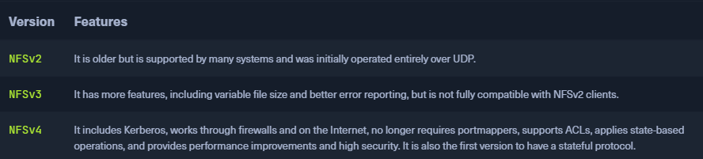
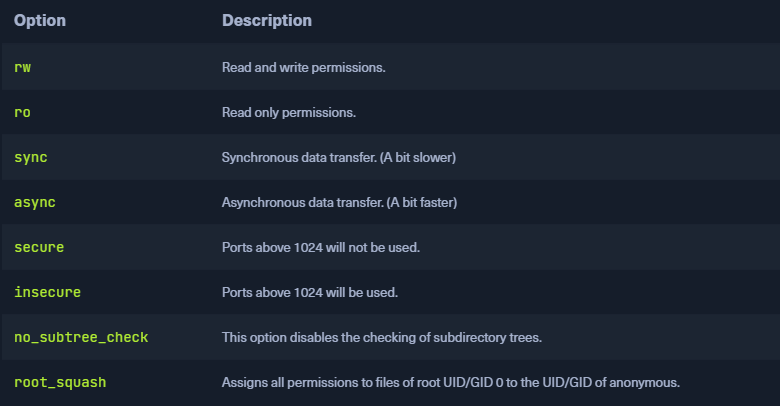
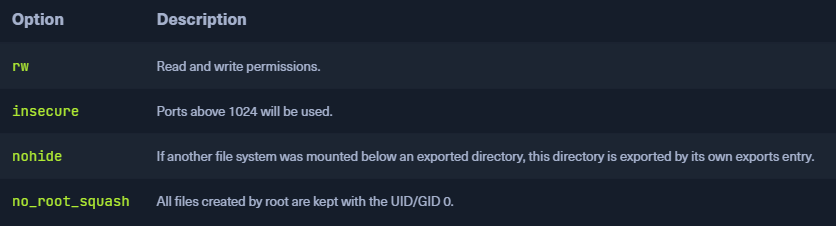

### NFS
* `Network File System` (`NFS`)
*  Same purpose as SMB
	* Access file systems over a network as if they were local
	* Entirely different protocol
* Used between Linux and Unix systems
* NFS clients cannot communicate directly with SMB servers
* `NFSv4` only uses one UDP or TCP port `2049`
* Based on the [Open Network Computing Remote Procedure Call](https://en.wikipedia.org/wiki/Sun_RPC) (`ONC-RPC`/`SUN-RPC`) protocol
	* `TCP` and `UDP` ports `111`
	* Uses [External Data Representation](https://en.wikipedia.org/wiki/External_Data_Representation) (`XDR`) for the system-independent exchange of data
* NFS protocol has `no` mechanism for `authentication` or `authorization`
	* Completely shifted to RPC protocol's options
	* Most common authentication is via UNIX `UID / GID` and `group memberships`
	* Should only be used in trusted networks



### Default Configuration
* `/etc/exports` contains a table of physical filesystems on an NFS server accessible by clients
* [NFS Exports Table](http://manpages.ubuntu.com/manpages/trusty/man5/exports.5.html) shows which options it accepts and thus indicates which options are available to us

```sh
$ cat /etc/exports 

# /etc/exports: the access control list for filesystems which may be exported
#               to NFS clients.  See exports(5).
#
# Example for NFSv2 and NFSv3:
# /srv/homes       hostname1(rw,sync,no_subtree_check) hostname2(ro,sync,no_subtree_check)
#
# Example for NFSv4:
# /srv/nfs4        gss/krb5i(rw,sync,fsid=0,crossmnt,no_subtree_check)
# /srv/nfs4/homes  gss/krb5i(rw,sync,no_subtree_check)
```

* The default `exports` file also contains some examples of configuring NFS shares
* First the folder is specified which makes it available to others, and then the rights they will have on this NFS share are connected to a host or a subnet
* Additional options can be added to the hosts or subnets



### ExportFS
```sh
root@nfs:~# echo '/mnt/nfs  10.129.14.0/24(sync,no_subtree_check)' >> /etc/exports
root@nfs:~# systemctl restart nfs-kernel-server 
root@nfs:~# exportfs

/mnt/nfs      	10.129.14.0/24
```

* This shares the folder `/mnt/nfs` to the subnet `10.129.14.0/24` with the given settings
* Clients in the subnet can mount the folder and inspect the contents inside 

### Dangerous Settings 


* For example, the `insecure` option allows users to use ports above 1024
* The first 1024 ports can only be used by root
* This prevents the fact that no users can use sockets above port 1024 for the NFS service and interact with it

### Footprinting the Service
* When footprinting NFS, the TCP ports `111` and `2049` are essential

```sh
$ sudo nmap 10.129.14.128 -p111,2049 -sV -sC

Starting Nmap 7.80 ( https://nmap.org ) at 2021-09-19 17:12 CEST
Nmap scan report for 10.129.14.128
Host is up (0.00018s latency).

PORT    STATE SERVICE VERSION
111/tcp open  rpcbind 2-4 (RPC #100000)
| rpcinfo: 
|   program version    port/proto  service
|   100000  2,3,4        111/tcp   rpcbind
|   100000  2,3,4        111/udp   rpcbind
|   100000  3,4          111/tcp6  rpcbind
|   100000  3,4          111/udp6  rpcbind
|   100003  3           2049/udp   nfs
|   100003  3           2049/udp6  nfs
|   100003  3,4         2049/tcp   nfs
|   100003  3,4         2049/tcp6  nfs
|   100005  1,2,3      41982/udp6  mountd
|   100005  1,2,3      45837/tcp   mountd
|   100005  1,2,3      47217/tcp6  mountd
|   100005  1,2,3      58830/udp   mountd
|   100021  1,3,4      39542/udp   nlockmgr
|   100021  1,3,4      44629/tcp   nlockmgr
|   100021  1,3,4      45273/tcp6  nlockmgr
|   100021  1,3,4      47524/udp6  nlockmgr
|   100227  3           2049/tcp   nfs_acl
|   100227  3           2049/tcp6  nfs_acl
|   100227  3           2049/udp   nfs_acl
|_  100227  3           2049/udp6  nfs_acl
2049/tcp open  nfs_acl 3 (RPC #100227)
MAC Address: 00:00:00:00:00:00 (VMware)
```

```sh
$ sudo nmap --script nfs* 10.129.14.128 -sV -p111,2049

Starting Nmap 7.80 ( https://nmap.org ) at 2021-09-19 17:37 CEST
Nmap scan report for 10.129.14.128
Host is up (0.00021s latency).

PORT     STATE SERVICE VERSION
111/tcp  open  rpcbind 2-4 (RPC #100000)
| nfs-ls: Volume /mnt/nfs
|   access: Read Lookup NoModify NoExtend NoDelete NoExecute
| PERMISSION  UID    GID    SIZE  TIME                 FILENAME
| rwxrwxrwx   65534  65534  4096  2021-09-19T15:28:17  .
| ??????????  ?      ?      ?     ?                    ..
| rw-r--r--   0      0      1872  2021-09-19T15:27:42  id_rsa
| rw-r--r--   0      0      348   2021-09-19T15:28:17  id_rsa.pub
| rw-r--r--   0      0      0     2021-09-19T15:22:30  nfs.share
|_
| nfs-showmount: 
|_  /mnt/nfs 10.129.14.0/24
| nfs-statfs: 
|   Filesystem  1K-blocks   Used       Available   Use%  Maxfilesize  Maxlink
|_  /mnt/nfs    30313412.0  8074868.0  20675664.0  29%   16.0T        32000
| rpcinfo: 
|   program version    port/proto  service
|   100000  2,3,4        111/tcp   rpcbind
|   100000  2,3,4        111/udp   rpcbind
|   100000  3,4          111/tcp6  rpcbind
|   100000  3,4          111/udp6  rpcbind
|   100003  3           2049/udp   nfs
|   100003  3           2049/udp6  nfs
|   100003  3,4         2049/tcp   nfs
|   100003  3,4         2049/tcp6  nfs
|   100005  1,2,3      41982/udp6  mountd
|   100005  1,2,3      45837/tcp   mountd
|   100005  1,2,3      47217/tcp6  mountd
|   100005  1,2,3      58830/udp   mountd
|   100021  1,3,4      39542/udp   nlockmgr
|   100021  1,3,4      44629/tcp   nlockmgr
|   100021  1,3,4      45273/tcp6  nlockmgr
|   100021  1,3,4      47524/udp6  nlockmgr
|   100227  3           2049/tcp   nfs_acl
|   100227  3           2049/tcp6  nfs_acl
|   100227  3           2049/udp   nfs_acl
|_  100227  3           2049/udp6  nfs_acl
2049/tcp open  nfs_acl 3 (RPC #100227)
MAC Address: 00:00:00:00:00:00 (VMware)
```

### Show Available NFS Shares
```sh
$ showmount -e 10.129.14.128

Export list for 10.129.14.128:
/mnt/nfs 10.129.14.0/2
```

### Mounting NFS Share
```sh
$ mkdir target-NFS
$ mount -t nfs 10.129.14.128:/ ./target-NFS/ -o nolock
$ cd target-NFS
$ tree .

.
└── mnt
    └── nfs
        ├── id_rsa
        ├── id_rsa.pub
        └── nfs.share

2 directories, 3 files
```

* Once we got the usernames, group names, UIDs, and GUIDs, we can create them on our system and adapt them to the NFS share to view and modify the files

### List Contents with Usernames & Group Names
```sh
$ ls -l mnt/nfs/

total 16
-rw-r--r-- 1 cry0l1t3 cry0l1t3 1872 Sep 25 00:55 cry0l1t3.priv
-rw-r--r-- 1 cry0l1t3 cry0l1t3  348 Sep 25 00:55 cry0l1t3.pub
-rw-r--r-- 1 root     root     1872 Sep 19 17:27 id_rsa
-rw-r--r-- 1 root     root      348 Sep 19 17:28 id_rsa.pub
-rw-r--r-- 1 root     root        0 Sep 19 17:22 nfs.share
```

### List Contents with UIDs & GUIDs
```sh
$ ls -n mnt/nfs/

total 16
-rw-r--r-- 1 1000 1000 1872 Sep 25 00:55 cry0l1t3.priv
-rw-r--r-- 1 1000 1000  348 Sep 25 00:55 cry0l1t3.pub
-rw-r--r-- 1    0    0 1872 Sep 19 17:27 id_rsa
-rw-r--r-- 1    0    0  348 Sep 19 17:28 id_rsa.pub
-rw-r--r-- 1    0    0    0 Sep 19 17:22 nfs.share
```

* After we obtained the information we need, we can unmount the NFS share

### Unmounting
```sh
$ cd ..
$ umount ./target-NFS
```