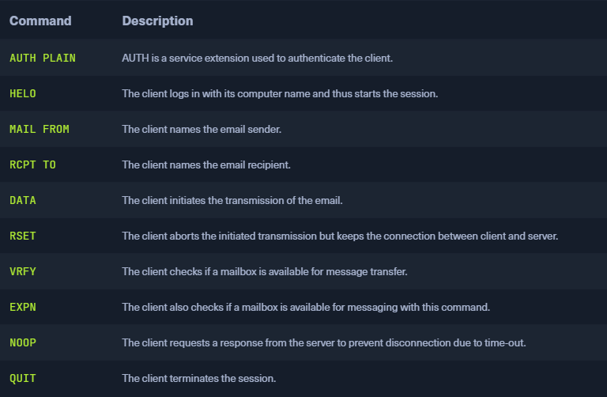

### SMTP
* `Simple Mail Transfer Protocol` (`SMTP`)
* Protocol for sending emails in an IP network
* Can be used between client and outgoing email server or between two SMPT servers
* Often combined with IMAP or POP3
* Default connection requests on port `25`
	* Newer servers also use TCP port `587`
	* Used to receive mails from authenticated users/servers
	* Usually by using the `STARTTLS` command to switch to an encryption connection
	* Client authenticates with username and password
* Sometimes a server uses a different port for encrypted connection e.g. `465`
* To prevent spam most servers support the `Extended SMTP` (`ESMTP`) protocol with SMPT-Auth
* After sending mail the client `Mail User Agent` (`MUA`) converts it into a header and a body and uploads both to the SMTP server
	* For this a so-called `Mail Transfer Agent` (`MTA`) software is used
* A `Mail Submission Agent` (`MSA`) checks the validity i.e., the origin of the mail
	* The MSA is also called `Relay` server
* The MTA then searches the DNS for the IP address of the recipient mail server
* On arrival the packets are reassembled to form a complete e-mail. From there, the `Mail delivery agent` (`MDA`) transfers it to the recipient's mailbox


* SMTP has two disadvantages
	1. Sending an email using SMTP does not return a usable delivery confirmation
	2. Users are not authenticated when a connection is established, and the sender of an email is therefore unreliable. As a result, open SMTP relays are often misused to send spam en masse. The originators use arbitrary fake sender addresses for this purpose to not be traced (mail spoofing). Today, many security techniques are used to prevent the misuse of SMTP servers

### Default Configuration
```sh
$ cat /etc/postfix/main.cf | grep -v "#" | sed -r "/^\s*$/d"

smtpd_banner = ESMTP Server 
biff = no
append_dot_mydomain = no
readme_directory = no
compatibility_level = 2
smtp_tls_session_cache_database = btree:${data_directory}/smtp_scache
myhostname = mail1.inlanefreight.htb
alias_maps = hash:/etc/aliases
alias_database = hash:/etc/aliases
smtp_generic_maps = hash:/etc/postfix/generic
mydestination = $myhostname, localhost 
masquerade_domains = $myhostname
mynetworks = 127.0.0.0/8 10.129.0.0/16
mailbox_size_limit = 0
recipient_delimiter = +
smtp_bind_address = 0.0.0.0
inet_protocols = ipv4
smtpd_helo_restrictions = reject_invalid_hostname
home_mailbox = /home/postfix
```

* The sending and communication are also done by special commands that cause the SMTP server to do what the user requires



* Interact with the service via `telnet`  

```sh
$ telnet 10.129.14.128 25

Trying 10.129.14.128...
Connected to 10.129.14.128.
Escape character is '^]'.
220 ESMTP Server 


HELO mail1.inlanefreight.htb

250 mail1.inlanefreight.htb


EHLO mail1

250-mail1.inlanefreight.htb
250-PIPELINING
250-SIZE 10240000
250-ETRN
250-ENHANCEDSTATUSCODES
250-8BITMIME
250-DSN
250-SMTPUTF8
250 CHUNKING
```

* `VRFY` can be used to enumerate existing users on the system
	* Does not always work, depending on the configuration
	* Server may issue code `252` and confirm the existence of a user that does not exist

```sh
$ telnet 10.129.14.128 25

Trying 10.129.14.128...
Connected to 10.129.14.128.
Escape character is '^]'.
220 ESMTP Server 

VRFY root

252 2.0.0 root


VRFY cry0l1t3

252 2.0.0 cry0l1t3


VRFY testuser

252 2.0.0 testuser


VRFY aaaaaaaaaaaaaaaaaaaaaaaaaaaa

252 2.0.0 aaaaaaaaaaaaaaaaaaaaaaaaaaaa
```

### Send an Email
```sh
$ telnet 10.129.14.128 25

Trying 10.129.14.128...
Connected to 10.129.14.128.
Escape character is '^]'.
220 ESMTP Server


EHLO inlanefreight.htb

250-mail1.inlanefreight.htb
250-PIPELINING
250-SIZE 10240000
250-ETRN
250-ENHANCEDSTATUSCODES
250-8BITMIME
250-DSN
250-SMTPUTF8
250 CHUNKING


MAIL FROM: <cry0l1t3@inlanefreight.htb>

250 2.1.0 Ok


RCPT TO: <mrb3n@inlanefreight.htb> NOTIFY=success,failure

250 2.1.5 Ok


DATA

354 End data with <CR><LF>.<CR><LF>

From: <cry0l1t3@inlanefreight.htb>
To: <mrb3n@inlanefreight.htb>
Subject: DB
Date: Tue, 28 Sept 2021 16:32:51 +0200
Hey man, I am trying to access our XY-DB but the creds don't work. 
Did you make any changes there?
.

250 2.0.0 Ok: queued as 6E1CF1681AB


QUIT

221 2.0.0 Bye
Connection closed by foreign host.
```

### Dangerous Settings
* To prevent sent emails from being filtered by spam, the sender can use a relay server that the recipient trusts
	* A SMTP server that is known and verified by all others
	* Sender has to authenticate himself to the relay server
* Often, administrators have no overview of which IP ranges they have to allow
	* Misconfiguration of the SMTP server
	* They allow IP's to not cause errors in the email traffic

### Open Relay Configuration
```sh
mynetworks = 0.0.0.0/0
```

* With this configuration, the SMTP server can send fake emails
	* Initialize communication between multiple parties
* Spoofing the email and read it is another possibility

### Footprinting the Service
```sh
$ sudo nmap 10.129.14.128 -sC -sV -p25

Starting Nmap 7.80 ( https://nmap.org ) at 2021-09-27 17:56 CEST
Nmap scan report for 10.129.14.128
Host is up (0.00025s latency).

PORT   STATE SERVICE VERSION
25/tcp open  smtp    Postfix smtpd
|_smtp-commands: mail1.inlanefreight.htb, PIPELINING, SIZE 10240000, VRFY, ETRN, ENHANCEDSTATUSCODES, 8BITMIME, DSN, SMTPUTF8, CHUNKING, 
MAC Address: 00:00:00:00:00:00 (VMware)
```

* We can also use the [smtp-open-relay](https://nmap.org/nsedoc/scripts/smtp-open-relay.html) NSE script to identify the target SMTP server as an open relay using 16 different tests 

```sh
$ sudo nmap 10.129.14.128 -p25 --script smtp-open-relay

Starting Nmap 7.80 ( https://nmap.org ) at 2021-09-30 02:29 CEST

PORT   STATE SERVICE
25/tcp open  smtp
| smtp-open-relay: Server is an open relay (16/16 tests)
|  MAIL FROM:<> -> RCPT TO:<relaytest@nmap.scanme.org>
|  MAIL FROM:<antispam@nmap.scanme.org> -> RCPT TO:<relaytest@nmap.scanme.org>
|  MAIL FROM:<antispam@ESMTP> -> RCPT TO:<relaytest@nmap.scanme.org>
|  MAIL FROM:<antispam@[10.129.14.128]> -> RCPT TO:<relaytest@nmap.scanme.org>
|  MAIL FROM:<antispam@[10.129.14.128]> -> RCPT TO:<relaytest%nmap.scanme.org@[10.129.14.128]>
|  MAIL FROM:<antispam@[10.129.14.128]> -> RCPT TO:<relaytest%nmap.scanme.org@ESMTP>
|  MAIL FROM:<antispam@[10.129.14.128]> -> RCPT TO:<"relaytest@nmap.scanme.org">
|  MAIL FROM:<antispam@[10.129.14.128]> -> RCPT TO:<"relaytest%nmap.scanme.org">
|  MAIL FROM:<antispam@[10.129.14.128]> -> RCPT TO:<relaytest@nmap.scanme.org@[10.129.14.128]>
|  MAIL FROM:<antispam@[10.129.14.128]> -> RCPT TO:<"relaytest@nmap.scanme.org"@[10.129.14.128]>
|  MAIL FROM:<antispam@[10.129.14.128]> -> RCPT TO:<relaytest@nmap.scanme.org@ESMTP>
|  MAIL FROM:<antispam@[10.129.14.128]> -> RCPT TO:<@[10.129.14.128]:relaytest@nmap.scanme.org>
|  MAIL FROM:<antispam@[10.129.14.128]> -> RCPT TO:<@ESMTP:relaytest@nmap.scanme.org>
|  MAIL FROM:<antispam@[10.129.14.128]> -> RCPT TO:<nmap.scanme.org!relaytest>
|  MAIL FROM:<antispam@[10.129.14.128]> -> RCPT TO:<nmap.scanme.org!relaytest@[10.129.14.128]>
|_ MAIL FROM:<antispam@[10.129.14.128]> -> RCPT TO:<nmap.scanme.org!relaytest@ESMTP>
MAC Address: 00:00:00:00:00:00 (VMware)
```

