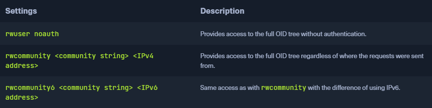

### SNMP
* `Simple Network Management Protocol` ([SNMP](https://datatracker.ietf.org/doc/html/rfc1157))
* Protocol for monitoring and managing network devices
* Can also be used to handle configuration tasks and change settings remotely
* Current version is `SNMPv3`
* SNMP transmits control commands using agents over UDP port `161`
	* Client can set specific values in the device and change options and settings with these commands
* Use of `traps` over UDP port `162`
	* Packets sent from SNMP server to client without being explicitly requested
	* If configured an SNMP trap is sent to the client once a specific event occurs on the server side

### MIB
* `Management Information Base` (`MIB`)
* Ensures access works across different client-server combinations
* Independent format for storing device information
* A MIB is a text file in which all queryable SNMP objects of a device are listed in a standardized tree hierarchy
* Contains at least one `Object Identifier` (`OID`)
	* In addition to unique address and a name also provides information about the type, access rights, and a description of the respective object
* MIB files written in `Abstract Syntax Notation One` (`ASN.1`) based ASCII text format
* MIBs don't chain data, but they explain where to find which information and what it looks like, which returns values for the specific OID, or which data type is used

### OID
* Represents a node in a hierarchical namespace
* Sequence of numbers uniquely identifies each node
	* Allows to determine the nodes position in the tree
	* Longer chains mean more information
* Many nodes in the OID tree contain nothing except references to those below them
* OIDs consist of integers usually concatenated by dot notation

### SNMPv2
* Different versions exists
	* Old version that still exists today `v2c`
	* Extension `c` means community-based
* A significant problem with the initial execution of the SNMP protocol is that the `community string` that provides security is only transmitted in plain text
* Not a lot of security

### SNMPv3
* Better security such as username and password transmission encryption (via `pre-shared key`) of the data
* Significantly more configuration options than `v2c`

### Community Strings
* Like a password that is used to determine whether the requested information can be viewed or not
* Many organizations still use `SNMPv2` because transition to `SNMPv3` is complex

### Default Configuration
* Default configuration defines basic settings for the service
	* Includes IP addresses, ports, MIB, OIDs, authentication, community strings
	
```sh
$ cat /etc/snmp/snmpd.conf | grep -v "#" | sed -r '/^\s*$/d'

sysLocation    Sitting on the Dock of the Bay
sysContact     Me <me@example.org>
sysServices    72
master  agentx
agentaddress  127.0.0.1,[::1]
view   systemonly  included   .1.3.6.1.2.1.1
view   systemonly  included   .1.3.6.1.2.1.25.1
rocommunity  public default -V systemonly
rocommunity6 public default -V systemonly
rouser authPrivUser authpriv -V systemonly
```

### Dangerous Settings


### Footprinting the Service
* We can use tools like`snmpwalk`, `onesixtyone`, and `braa` to query the OIDs with their information
	* `Onesixtyone` can be used to brute-force the names of the community strings
		* `onesixtyone -c <wordlist> <ip>`
	* Since these community strings can be bound to any source, identifying the existing community strings can take quite some time

```sh
$ snmpwalk -v2c -c public 10.129.14.128

iso.3.6.1.2.1.1.1.0 = STRING: "Linux htb 5.11.0-34-generic #36~20.04.1-Ubuntu SMP Fri Aug 27 08:06:32 UTC 2021 x86_64"
iso.3.6.1.2.1.1.2.0 = OID: iso.3.6.1.4.1.8072.3.2.10
iso.3.6.1.2.1.1.3.0 = Timeticks: (5134) 0:00:51.34
iso.3.6.1.2.1.1.4.0 = STRING: "mrb3n@inlanefreight.htb"
iso.3.6.1.2.1.1.5.0 = STRING: "htb"
iso.3.6.1.2.1.1.6.0 = STRING: "Sitting on the Dock of the Bay"
iso.3.6.1.2.1.1.7.0 = INTEGER: 72
iso.3.6.1.2.1.1.8.0 = Timeticks: (0) 0:00:00.00
iso.3.6.1.2.1.1.9.1.2.1 = OID: iso.3.6.1.6.3.10.3.1.1
iso.3.6.1.2.1.1.9.1.2.2 = OID: iso.3.6.1.6.3.11.3.1.1
iso.3.6.1.2.1.1.9.1.2.3 = OID: iso.3.6.1.6.3.15.2.1.1
iso.3.6.1.2.1.1.9.1.2.4 = OID: iso.3.6.1.6.3.1
iso.3.6.1.2.1.1.9.1.2.5 = OID: iso.3.6.1.6.3.16.2.2.1
iso.3.6.1.2.1.1.9.1.2.6 = OID: iso.3.6.1.2.1.49
iso.3.6.1.2.1.1.9.1.2.7 = OID: iso.3.6.1.2.1.4
iso.3.6.1.2.1.1.9.1.2.8 = OID: iso.3.6.1.2.1.50
iso.3.6.1.2.1.1.9.1.2.9 = OID: iso.3.6.1.6.3.13.3.1.3
iso.3.6.1.2.1.1.9.1.2.10 = OID: iso.3.6.1.2.1.92
iso.3.6.1.2.1.1.9.1.3.1 = STRING: "The SNMP Management Architecture MIB."
iso.3.6.1.2.1.1.9.1.3.2 = STRING: "The MIB for Message Processing and Dispatching."
iso.3.6.1.2.1.1.9.1.3.3 = STRING: "The management information definitions for the SNMP User-based Security Model."
iso.3.6.1.2.1.1.9.1.3.4 = STRING: "The MIB module for SNMPv2 entities"
iso.3.6.1.2.1.1.9.1.3.5 = STRING: "View-based Access Control Model for SNMP."
iso.3.6.1.2.1.1.9.1.3.6 = STRING: "The MIB module for managing TCP implementations"
iso.3.6.1.2.1.1.9.1.3.7 = STRING: "The MIB module for managing IP and ICMP implementations"
iso.3.6.1.2.1.1.9.1.3.8 = STRING: "The MIB module for managing UDP implementations"
iso.3.6.1.2.1.1.9.1.3.9 = STRING: "The MIB modules for managing SNMP Notification, plus filtering."
iso.3.6.1.2.1.1.9.1.3.10 = STRING: "The MIB module for logging SNMP Notifications."
iso.3.6.1.2.1.1.9.1.4.1 = Timeticks: (0) 0:00:00.00
iso.3.6.1.2.1.1.9.1.4.2 = Timeticks: (0) 0:00:00.00
iso.3.6.1.2.1.1.9.1.4.3 = Timeticks: (0) 0:00:00.00
iso.3.6.1.2.1.1.9.1.4.4 = Timeticks: (0) 0:00:00.00
iso.3.6.1.2.1.1.9.1.4.5 = Timeticks: (0) 0:00:00.00
iso.3.6.1.2.1.1.9.1.4.6 = Timeticks: (0) 0:00:00.00
iso.3.6.1.2.1.1.9.1.4.7 = Timeticks: (0) 0:00:00.00
iso.3.6.1.2.1.1.9.1.4.8 = Timeticks: (0) 0:00:00.00
iso.3.6.1.2.1.1.9.1.4.9 = Timeticks: (0) 0:00:00.00
iso.3.6.1.2.1.1.9.1.4.10 = Timeticks: (0) 0:00:00.00
iso.3.6.1.2.1.25.1.1.0 = Timeticks: (3676678) 10:12:46.78
iso.3.6.1.2.1.25.1.2.0 = Hex-STRING: 07 E5 09 14 0E 2B 2D 00 2B 02 00 
iso.3.6.1.2.1.25.1.3.0 = INTEGER: 393216
iso.3.6.1.2.1.25.1.4.0 = STRING: "BOOT_IMAGE=/boot/vmlinuz-5.11.0-34-generic root=UUID=9a6a5c52-f92a-42ea-8ddf-940d7e0f4223 ro quiet splash"
iso.3.6.1.2.1.25.1.5.0 = Gauge32: 3
iso.3.6.1.2.1.25.1.6.0 = Gauge32: 411
iso.3.6.1.2.1.25.1.7.0 = INTEGER: 0
iso.3.6.1.2.1.25.1.7.0 = No more variables left in this MIB View (It is past the end of the MIB tree)

...SNIP...

iso.3.6.1.2.1.25.6.3.1.2.1232 = STRING: "printer-driver-sag-gdi_0.1-7_all"
iso.3.6.1.2.1.25.6.3.1.2.1233 = STRING: "printer-driver-splix_2.0.0+svn315-7fakesync1build1_amd64"
iso.3.6.1.2.1.25.6.3.1.2.1234 = STRING: "procps_2:3.3.16-1ubuntu2.3_amd64"
iso.3.6.1.2.1.25.6.3.1.2.1235 = STRING: "proftpd-basic_1.3.6c-2_amd64"
iso.3.6.1.2.1.25.6.3.1.2.1236 = STRING: "proftpd-doc_1.3.6c-2_all"
iso.3.6.1.2.1.25.6.3.1.2.1237 = STRING: "psmisc_23.3-1_amd64"
iso.3.6.1.2.1.25.6.3.1.2.1238 = STRING: "publicsuffix_20200303.0012-1_all"
iso.3.6.1.2.1.25.6.3.1.2.1239 = STRING: "pulseaudio_1:13.99.1-1ubuntu3.12_amd64"
iso.3.6.1.2.1.25.6.3.1.2.1240 = STRING: "pulseaudio-module-bluetooth_1:13.99.1-1ubuntu3.12_amd64"
iso.3.6.1.2.1.25.6.3.1.2.1241 = STRING: "pulseaudio-utils_1:13.99.1-1ubuntu3.12_amd64"
iso.3.6.1.2.1.25.6.3.1.2.1242 = STRING: "python-apt-common_2.0.0ubuntu0.20.04.6_all"
iso.3.6.1.2.1.25.6.3.1.2.1243 = STRING: "python3_3.8.2-0ubuntu2_amd64"
iso.3.6.1.2.1.25.6.3.1.2.1244 = STRING: "python3-acme_1.1.0-1_all"
iso.3.6.1.2.1.25.6.3.1.2.1245 = STRING: "python3-apport_2.20.11-0ubuntu27.21_all"
iso.3.6.1.2.1.25.6.3.1.2.1246 = STRING: "python3-apt_2.0.0ubuntu0.20.04.6_amd64" 

...SNIP...
```

* Once we know the community string and the SNMP service that does not require authentication (versions 1, 2c), we can query internal system information
* We recognize some Python packages that have been installed on the system
	* If we do not know the community string, we can use `onesixtyone` and `SecLists` wordlists to identify these community strings

```sh
$ onesixtyone -c /opt/useful/SecLists/Discovery/SNMP/snmp.txt 10.129.14.128

Scanning 1 hosts, 3220 communities
10.129.14.128 [public] Linux htb 5.11.0-37-generic #41~20.04.2-Ubuntu SMP Fri Sep 24 09:06:38 UTC 2021 x86_64
```

* We can use the tool [crunch](https://github.com/fpolit/crunch) to create custom wordlists
* Once we know a community string, we can use it with [braa](https://github.com/mteg/braa) to brute-force the individual OIDs and enumerate the information behind them

```sh
$ braa <community string>@<IP>:.1.3.6.*   # Syntax
$ braa public@10.129.14.128:.1.3.6.*

10.129.14.128:20ms:.1.3.6.1.2.1.1.1.0:Linux htb 5.11.0-34-generic #36~20.04.1-Ubuntu SMP Fri Aug 27 08:06:32 UTC 2021 x86_64
10.129.14.128:20ms:.1.3.6.1.2.1.1.2.0:.1.3.6.1.4.1.8072.3.2.10
10.129.14.128:20ms:.1.3.6.1.2.1.1.3.0:548
10.129.14.128:20ms:.1.3.6.1.2.1.1.4.0:mrb3n@inlanefreight.htb
10.129.14.128:20ms:.1.3.6.1.2.1.1.5.0:htb
10.129.14.128:20ms:.1.3.6.1.2.1.1.6.0:US
10.129.14.128:20ms:.1.3.6.1.2.1.1.7.0:78
...SNIP...
```