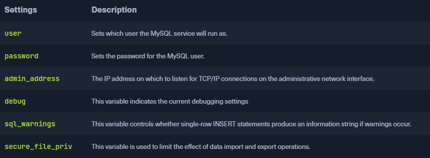
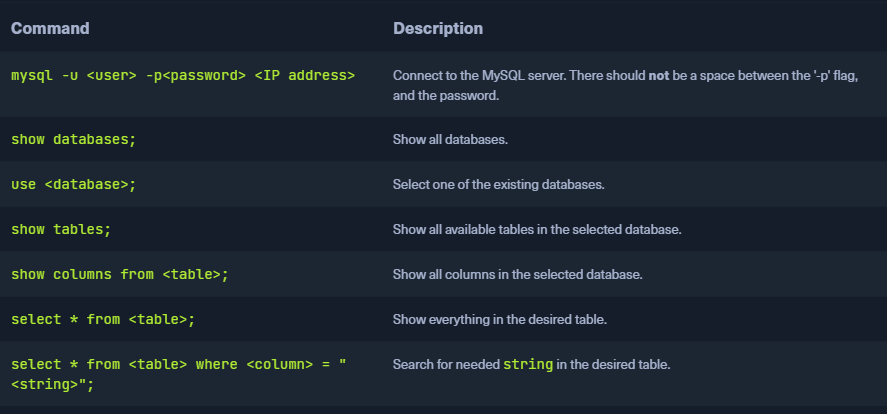

### MySQL
* Open-source SQL database management system
* MySQL works according to the `client-server principle` and consists of a MySQL server and one or more MySQL clients
* Databases often stored in a single file `.sql`

### MySQL Clients
* Retrieve and edit data using structured queries to the database engine
	* Insert, modify, delete, and retrieve data

### MySQL Databases
* Ideally suited for applications such as `dynamic websites` where speed is needed
* Often combined with a Linux OS, PHP, and Apache web servers
	* `LAMP` (Linux, Apache, MySQL, PHP) or `LEMP` when using NGINX
* Generally encrypted beforehand by PHP scripts using secure methods such as [One-Way-Encryption](https://en.citizendium.org/wiki/One-way_encryption)

### MySQL Commands
* Databases internally translate commands into executable code and perform the requested action
* Web application informs the user if an error occurs during this process
* Web application send the generated information back to client on success
	* Data extracts from a table or records needed for further processing with logins etc.

### Default Configuration
* Extremely large topic 
	* `database administrator`, deal with almost nothing but databases
* Among other things, DB management is a core competency for `software developers` but also `information security analysts`

```sh
$ cat /etc/mysql/mysql.conf.d/mysqld.cnf | grep -v "#" | sed -r '/^\s*$/d'

[client]
port		= 3306
socket		= /var/run/mysqld/mysqld.sock

[mysqld_safe]
pid-file	= /var/run/mysqld/mysqld.pid
socket		= /var/run/mysqld/mysqld.sock
nice		= 0

[mysqld]
skip-host-cache
skip-name-resolve
user		= mysql
pid-file	= /var/run/mysqld/mysqld.pid
socket		= /var/run/mysqld/mysqld.sock
port		= 3306
basedir		= /usr
datadir		= /var/lib/mysql
tmpdir		= /tmp
lc-messages-dir	= /usr/share/mysql
explicit_defaults_for_timestamp

symbolic-links=0

!includedir /etc/mysql/conf.d/
```

### Dangerous Settings
* Many things can be misconfigured with MySQL



* The settings `user`, `password`, and `admin_address` are security-relevant because the entries are made in plain text
	* Often rights for configuration file of MySQL server not assigned correctly
	* If we get a way to read files or even a shell we can retrieve sensitive information
* The `debug` and `sql_warnings` settings provide verbose information output in case of errors
	* Often directly displayed in the web application
	* SQL injection becomes easier

### Footprinting the Service
* Sometimes databases are reachable from the outside 
	* Often only meant to be temporary but forgotten by the administrator
* Usually MySQL server runs on TCP port `3306` which we can scan with nmap

```sh
$ sudo nmap 10.129.14.128 -sV -sC -p3306 --script mysql*

Starting Nmap 7.80 ( https://nmap.org ) at 2021-09-21 00:53 CEST
Nmap scan report for 10.129.14.128
Host is up (0.00021s latency).

PORT     STATE SERVICE     VERSION
3306/tcp open  nagios-nsca Nagios NSCA
| mysql-brute: 
|   Accounts: 
|     root:<empty> - Valid credentials
|_  Statistics: Performed 45010 guesses in 5 seconds, average tps: 9002.0
|_mysql-databases: ERROR: Script execution failed (use -d to debug)
|_mysql-dump-hashes: ERROR: Script execution failed (use -d to debug)
| mysql-empty-password: 
|_  root account has empty password
| mysql-enum: 
|   Valid usernames: 
|     root:<empty> - Valid credentials
|     netadmin:<empty> - Valid credentials
|     guest:<empty> - Valid credentials
|     user:<empty> - Valid credentials
|     web:<empty> - Valid credentials
|     sysadmin:<empty> - Valid credentials
|     administrator:<empty> - Valid credentials
|     webadmin:<empty> - Valid credentials
|     admin:<empty> - Valid credentials
|     test:<empty> - Valid credentials
|_  Statistics: Performed 10 guesses in 1 seconds, average tps: 10.0
| mysql-info: 
|   Protocol: 10
|   Version: 8.0.26-0ubuntu0.20.04.1
|   Thread ID: 13
|   Capabilities flags: 65535
|   Some Capabilities: SupportsLoadDataLocal, SupportsTransactions, Speaks41ProtocolOld, LongPassword, DontAllowDatabaseTableColumn, Support41Auth, IgnoreSigpipes, SwitchToSSLAfterHandshake, FoundRows, InteractiveClient, Speaks41ProtocolNew, ConnectWithDatabase, IgnoreSpaceBeforeParenthesis, LongColumnFlag, SupportsCompression, ODBCClient, SupportsMultipleStatments, SupportsAuthPlugins, SupportsMultipleResults
|   Status: Autocommit
|   Salt: YTSgMfqvx\x0F\x7F\x16\&\x1EAeK>0
|_  Auth Plugin Name: caching_sha2_password
|_mysql-users: ERROR: Script execution failed (use -d to debug)
|_mysql-variables: ERROR: Script execution failed (use -d to debug)
|_mysql-vuln-cve2012-2122: ERROR: Script execution failed (use -d to debug)
MAC Address: 00:00:00:00:00:00 (VMware)
```

* We still should confirm the information gathered manually because there could be false-positives

```sh
$ mysql -u root -h 10.129.14.132

ERROR 1045 (28000): Access denied for user 'root'@'10.129.14.1' (using password: NO)
d```

* As an example above we can see that for a fact the root user does not use an empty password
* If we however found credentials for an account we can log into the database

```sh
$ mysql -u root -pP4SSw0rd -h 10.129.14.128

Welcome to the MariaDB monitor.  Commands end with ; or \g.
Your MySQL connection id is 150165
Server version: 8.0.27-0ubuntu0.20.04.1 (Ubuntu)                                                         
Copyright (c) 2000, 2018, Oracle, MariaDB Corporation Ab and others.                                     
Type 'help;' or '\h' for help. Type '\c' to clear the current input statement.                           
      
MySQL [(none)]> show databases;                                                                          
+--------------------+
| Database           |
+--------------------+
| information_schema |
| mysql              |
| performance_schema |
| sys                |
+--------------------+
4 rows in set (0.006 sec)


MySQL [(none)]> select version();
+-------------------------+
| version()               |
+-------------------------+
| 8.0.27-0ubuntu0.20.04.1 |
+-------------------------+
1 row in set (0.001 sec)


MySQL [(none)]> use mysql;
MySQL [mysql]> show tables;
+------------------------------------------------------+
| Tables_in_mysql                                      |
+------------------------------------------------------+
| columns_priv                                         |
| component                                            |
| db                                                   |
| default_roles                                        |
| engine_cost                                          |
| func                                                 |
| general_log                                          |
| global_grants                                        |
| gtid_executed                                        |
| help_category                                        |
| help_keyword                                         |
| help_relation                                        |
| help_topic                                           |
| innodb_index_stats                                   |
| innodb_table_stats                                   |
| password_history                                     |
...SNIP...
| user                                                 |
+------------------------------------------------------+
37 rows in set (0.002 sec)
```

* The most important databases are `system schema` (`sys`) and `information schema` (`information_schema`)
	* System schema contains tables, information, and metadata necessary for management
	* The `information schema` is also a database that contains metadata
		* This metadata is mainly retrieved from the `system schema` database
* `System schema` is a Microsoft system catalog for SQL servers and contains much more information than the `information schema`

```sh
mysql> use sys;
mysql> show tables;  

+-----------------------------------------------+
| Tables_in_sys                                 |
+-----------------------------------------------+
| host_summary                                  |
| host_summary_by_file_io                       |
| host_summary_by_file_io_type                  |
| host_summary_by_stages                        |
| host_summary_by_statement_latency             |
| host_summary_by_statement_type                |
| innodb_buffer_stats_by_schema                 |
| innodb_buffer_stats_by_table                  |
| innodb_lock_waits                             |
| io_by_thread_by_latency                       |
...SNIP...
| x$waits_global_by_latency                     |
+-----------------------------------------------+


mysql> select host, unique_users from host_summary;

+-------------+--------------+                   
| host        | unique_users |                   
+-------------+--------------+                   
| 10.129.14.1 |            1 |                   
| localhost   |            2 |                   
+-------------+--------------+                   
2 rows in set (0,01 sec) 
```

### Useful commands


