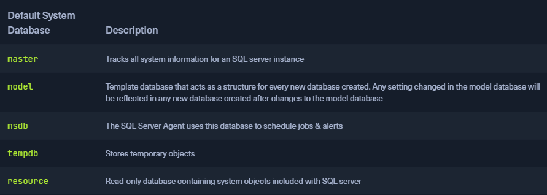

### MSSQL
* [Microsoft SQL](https://www.microsoft.com/en-us/sql-server/sql-server-2019) (`MSSQL`)
* Unlike MySQL, MSSQL is closed source
* Popular for Windows apps and developers that use .NET framework

### MSSQL Clients
* [SQL Server Management Studio](https://docs.microsoft.com/en-us/sql/ssms/download-sql-server-management-studio-ssms?view=sql-server-ver15) (`SSMS`)
* Many different clients can connect to MSSQL since SSMS is client-side application
* To locate the client on our system we can use the following command

```sh
$ locate mssqlclient

/usr/bin/impacket-mssqlclient
/usr/share/doc/python3-impacket/examples/mssqlclient.py
```

### MSSQL Databases
* Has default databases that help to understand the structure



### Default Configuration
* When initially installing MSSQL, the service will run as `NT SERVICE\MSSQLSERVER`
* Connecting from the client-side is possible through Windows Authentication, and by default, encryption is not enforced when attempting to connect

### Dangerous Settings
-   MSSQL clients not using encryption to connect to the MSSQL server
-   The use of self-signed certificates when encryption is being used. It is possible to spoof self-signed certificates
-   The use of [named pipes](https://docs.microsoft.com/en-us/sql/tools/configuration-manager/named-pipes-properties?view=sql-server-ver15)
-   Weak & default `sa` credentials. Admins may forget to disable this account etc.

### Footprinting the Service
* MSSQL uses the default TCP port `1433`

```sh
$ sudo nmap --script ms-sql-info,ms-sql-empty-password,ms-sql-xp-cmdshell,ms-sql-config,ms-sql-ntlm-info,ms-sql-tables,ms-sql-hasdbaccess,ms-sql-dac,ms-sql-dump-hashes --script-args mssql.instance-port=1433,mssql.username=sa,mssql.password=,mssql.instance-name=MSSQLSERVER -sV -p 1433 10.129.201.248

Starting Nmap 7.91 ( https://nmap.org ) at 2021-11-08 09:40 EST
Nmap scan report for 10.129.201.248
Host is up (0.15s latency).

PORT     STATE SERVICE  VERSION
1433/tcp open  ms-sql-s Microsoft SQL Server 2019 15.00.2000.00; RTM
| ms-sql-ntlm-info: 
|   Target_Name: SQL-01
|   NetBIOS_Domain_Name: SQL-01
|   NetBIOS_Computer_Name: SQL-01
|   DNS_Domain_Name: SQL-01
|   DNS_Computer_Name: SQL-01
|_  Product_Version: 10.0.17763

Host script results:
| ms-sql-dac: 
|_  Instance: MSSQLSERVER; DAC port: 1434 (connection failed)
| ms-sql-info: 
|   Windows server name: SQL-01
|   10.129.201.248\MSSQLSERVER: 
|     Instance name: MSSQLSERVER
|     Version: 
|       name: Microsoft SQL Server 2019 RTM
|       number: 15.00.2000.00
|       Product: Microsoft SQL Server 2019
|       Service pack level: RTM
|       Post-SP patches applied: false
|     TCP port: 1433
|     Named pipe: \\10.129.201.248\pipe\sql\query
|_    Clustered: false
```

```sh
msf6 auxiliary(scanner/mssql/mssql_ping) > set rhosts 10.129.201.248

rhosts => 10.129.201.248


msf6 auxiliary(scanner/mssql/mssql_ping) > run

[*] 10.129.201.248:       - SQL Server information for 10.129.201.248:
[+] 10.129.201.248:       -    ServerName      = SQL-01
[+] 10.129.201.248:       -    InstanceName    = MSSQLSERVER
[+] 10.129.201.248:       -    IsClustered     = No
[+] 10.129.201.248:       -    Version         = 15.0.2000.5
[+] 10.129.201.248:       -    tcp             = 1433
[+] 10.129.201.248:       -    np              = \\SQL-01\pipe\sql\query
[*] 10.129.201.248:       - Scanned 1 of 1 hosts (100% complete)
[*] Auxiliary module execution completed
```

### Connecting with Mssqlclient.py
* If we guess or gain credentials, we can remotely connect to the server using T-SQL (`Transact-SQL`)

```sh
$ python3 mssqlclient.py Administrator@10.129.201.248 -windows-auth

Impacket v0.9.22 - Copyright 2020 SecureAuth Corporation

Password:
[*] Encryption required, switching to TLS
[*] ENVCHANGE(DATABASE): Old Value: master, New Value: master
[*] ENVCHANGE(LANGUAGE): Old Value: , New Value: us_english
[*] ENVCHANGE(PACKETSIZE): Old Value: 4096, New Value: 16192
[*] INFO(SQL-01): Line 1: Changed database context to 'master'.
[*] INFO(SQL-01): Line 1: Changed language setting to us_english.
[*] ACK: Result: 1 - Microsoft SQL Server (150 7208) 
[!] Press help for extra shell commands

SQL> select name from sys.databases

name                                                                                                                               

--------------------------------------------------------------------------------------

master                                                                                                                             

tempdb                                                                                                                             

model                                                                                                                              

msdb                                                                                                                               

Transactions   
```