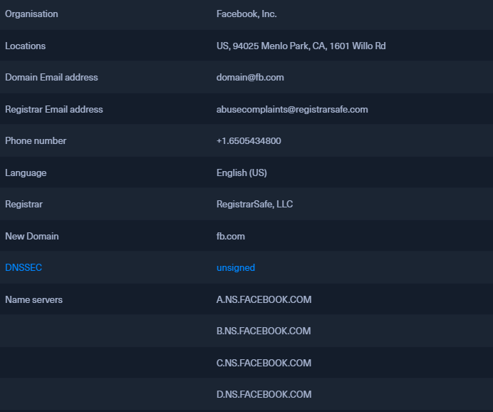

### WHOIS
* TCP-based transaction-oriented query/response protocol listening on TCP port `43`
* Can be used to query databases
	* Domain names
	* IP's
	* Autonomous systems
* Allows to retrieve information about the domain name of an already registered domain
*  The [Internet Corporation of Assigned Names and Numbers](https://www.icann.org/get-started) (`ICANN`) requires that accredited registrars enter the holder's contact information, the domain's creation, and expiration dates, and other information in the Whois database immediately after registering a domain

```shell-session
$ export TARGET="facebook.com" # Assign our target to an environment variable
$ whois $TARGET

Domain Name: FACEBOOK.COM
Registry Domain ID: 2320948_DOMAIN_COM-VRSN
Registrar WHOIS Server: whois.registrarsafe.com
Registrar URL: https://www.registrarsafe.com
Updated Date: 2021-09-22T19:33:41Z
Creation Date: 1997-03-29T05:00:00Z
Registrar Registration Expiration Date: 2030-03-30T04:00:00Z
Registrar: RegistrarSafe, LLC
Registrar IANA ID: 3237
Registrar Abuse Contact Email: abusecomplaints@registrarsafe.com
Registrar Abuse Contact Phone: +1.6503087004
Domain Status: clientDeleteProhibited https://www.icann.org/epp#clientDeleteProhibited
Domain Status: clientTransferProhibited https://www.icann.org/epp#clientTransferProhibited
Domain Status: clientUpdateProhibited https://www.icann.org/epp#clientUpdateProhibited
Domain Status: serverDeleteProhibited https://www.icann.org/epp#serverDeleteProhibited
Domain Status: serverTransferProhibited https://www.icann.org/epp#serverTransferProhibited
Domain Status: serverUpdateProhibited https://www.icann.org/epp#serverUpdateProhibited
Registry Registrant ID:
Registrant Name: Domain Admin
Registrant Organization: Facebook, Inc.
Registrant Street: 1601 Willow Rd
Registrant City: Menlo Park
Registrant State/Province: CA
Registrant Postal Code: 94025
Registrant Country: US
Registrant Phone: +1.6505434800
Registrant Phone Ext:
Registrant Fax: +1.6505434800
Registrant Fax Ext:
Registrant Email: domain@fb.com
Registry Admin ID:
Admin Name: Domain Admin
Admin Organization: Facebook, Inc.
Admin Street: 1601 Willow Rd
Admin City: Menlo Park
Admin State/Province: CA
Admin Postal Code: 94025
Admin Country: US
Admin Phone: +1.6505434800
Admin Phone Ext:
Admin Fax: +1.6505434800
Admin Fax Ext:
Admin Email: domain@fb.com
Registry Tech ID:
Tech Name: Domain Admin
Tech Organization: Facebook, Inc.
Tech Street: 1601 Willow Rd
Tech City: Menlo Park
Tech State/Province: CA
Tech Postal Code: 94025
Tech Country: US
Tech Phone: +1.6505434800
Tech Phone Ext:
Tech Fax: +1.6505434800
Tech Fax Ext:
Tech Email: domain@fb.com
Name Server: C.NS.FACEBOOK.COM
Name Server: B.NS.FACEBOOK.COM
Name Server: A.NS.FACEBOOK.COM
Name Server: D.NS.FACEBOOK.COM
DNSSEC: unsigned

<SNIP>
```

* We gathered the following information which is essential data that we want to note down for later use



