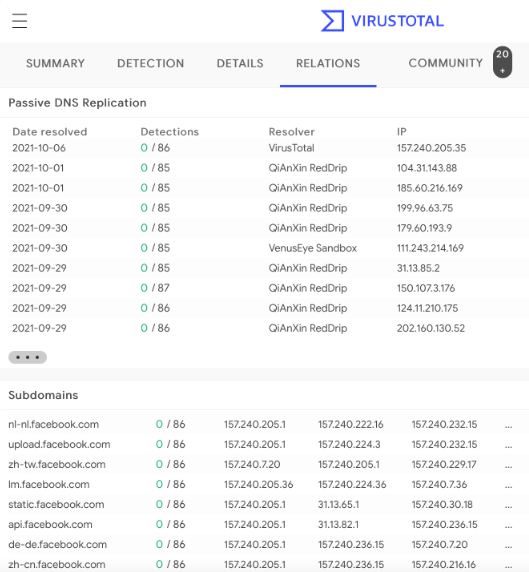

### VirusTotal
* VirusTotal maintains its DNS replication service, which is developed by preserving DNS resolutions made when users visit URLs given by them. To receive information about a domain, type the domain name into the search bar and click on the "Relations" tab

