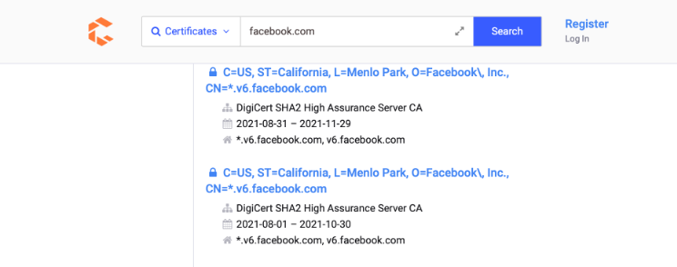
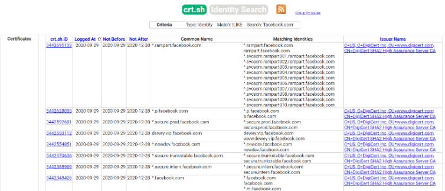

### Certificates
-   [https://censys.io](https://censys.io/)
-   [https://crt.sh](https://crt.sh/)



### Certificate Transparency
```sh
$ export TARGET="facebook.com"
$ curl -s "https://crt.sh/?q=${TARGET}&output=json" | jq -r '.[] | "\(.name_value)\n\(.common_name)"' | sort -u > "${TARGET}_crt.sh.txt"
```

```sh
$ head -n20 facebook.com_crt.sh.txt

*.adtools.facebook.com
*.ak.facebook.com
*.ak.fbcdn.net
*.alpha.facebook.com
*.assistant.facebook.com
*.beta.facebook.com
*.channel.facebook.com
*.cinyour.facebook.com
*.cinyourrc.facebook.com
*.connect.facebook.com
*.cstools.facebook.com
*.ctscan.facebook.com
*.dev.facebook.com
*.dns.facebook.com
*.extern.facebook.com
*.extools.facebook.com
*.f--facebook.com
*.facebook.com
*.facebookcorewwwi.onion
*.facebookmail.com
```

* Or perform this operation manually

```sh
$ export TARGET="facebook.com"
$ export PORT="443"
$ openssl s_client -ign_eof 2>/dev/null <<<$'HEAD / HTTP/1.0\r\n\r' -connect "${TARGET}:${PORT}" | openssl x509 -noout -text -in - | grep 'DNS' | sed -e 's|DNS:|\n|g' -e 's|^\*.*||g' | tr -d ',' | sort -u

*.facebook.com
*.facebook.net
*.fbcdn.net
*.fbsbx.com
*.m.facebook.com
*.messenger.com
*.xx.fbcdn.net
*.xy.fbcdn.net
*.xz.fbcdn.net
facebook.com
messenger.com
```

| Command                                          | Description                                                                            |
| ------------------------------------------------ | -------------------------------------------------------------------------------------- |
| `curl -s`                                        | Issue the request with minimal output                                                  |
| `https://crt.sh/?q=<DOMAIN>&output=json`         | Ask for the json output                                                                |
| `jq -r '.[]' "\(.name_value)\n\(.common_name)"'` | Process the json output and print certificate's name vale and common name one per line |
| `sort -u`                                        | Sort alphabetically the output provided and removes duplicates                         | 

### [TheHarvester](https://github.com/laramies/theHarvester)
* Early-stage penetration testing tool
* Collects `emails`, `names`, `subdomains`, `IP addresses`, and `URLs` from various public data sources for passive information gathering

| Command      | Description                                                                                                        |
| ------------ | ------------------------------------------------------------------------------------------------------------------ |
| [Baidu](http://www.baidu.com/)        | Baidu search engine.                                                                                               |
| Bufferoverun | Uses data from Rapid7's Project Sonar - www.rapid7.com/research/project-sonar/                                     |
| [Crtsh](https://crt.sh/)        | Comodo Certificate search.                                                                                         |
| [Hackertarget](https://hackertarget.com/) | Online vulnerability scanners and network intelligence to help organizations.                                      |
| Otx          | AlienVault Open Threat Exchange - https://otx.alienvault.com                                                       |
| [Rapiddns](https://rapiddns.io/)     | DNS query tool, which makes querying subdomains or sites using the same IP easy.                                   |
| Sublist3r    | Fast subdomains enumeration tool for penetration testers - https://api.sublist3r.com/search.php?domain=example.com |
| Threatcrowd  | Open source threat intelligence.                                                                                   |
| [Threatminer](https://www.threatminer.org/)  | Data mining for threat intelligence.                                                                               |
| Trello       | Search Trello boards (Uses Google search)                                                                          |
| [Urlscan](https://urlscan.io/)      | A sandbox for the web that is a URL and website scanner.                                                           |
| Vhost        | Bing virtual hosts search.                                                                                         |
| [Virustotal](https://www.virustotal.com/gui/home/search)   | Domain search.                                                                                                     |
| [Zoomeye](https://www.zoomeye.org/)      | A Chinese version of Shodan.                                                                                       |

* To automate this we create a file called sources.txt

```sh
$ cat sources.txt

baidu
bufferoverun
crtsh
hackertarget
otx
projecdiscovery
rapiddns
sublist3r
threatcrowd
trello
urlscan
vhost
virustotal
zoomeye
```

```sh
$ export TARGET="facebook.com"
$ cat sources.txt | while read source; do theHarvester -d "${TARGET}" -b 
  $source -f "${source}_${TARGET}";done

<SNIP>
*******************************************************************
*  _   _                                            _             *
* | |_| |__   ___    /\  /\__ _ _ ____   _____  ___| |_ ___ _ __  *
* | __|  _ \ / _ \  / /_/ / _` | '__\ \ / / _ \/ __| __/ _ \ '__| *
* | |_| | | |  __/ / __  / (_| | |   \ V /  __/\__ \ ||  __/ |    *
*  \__|_| |_|\___| \/ /_/ \__,_|_|    \_/ \___||___/\__\___|_|    *
*                                                                 *
* theHarvester 4.0.0                                              *
* Coded by Christian Martorella                                   *
* Edge-Security Research                                          *
* cmartorella@edge-security.com                                   *
*                                                                 *
*******************************************************************


[*] Target: facebook.com

[*] Searching Urlscan.

[*] ASNS found: 29
--------------------
AS12578
AS13335
AS13535
AS136023
AS14061
AS14618
AS15169
AS15817

<SNIP>
```

* Extract all subdomains found and sort them 

```sh
$ cat *.json | jq -r '.hosts[]' 2>/dev/null | cut -d':' -f 1 | sort -u > "${TARGET}_theHarvester.txt"
```

* Now we can merge all the passive reconnaissance files via

```sh
$ cat facebook.com_*.txt | sort -u > facebook.com_subdomains_passive.txt
$ cat facebook.com_subdomains_passive.txt | wc -l

11947 # Amount of subdomains found
```
