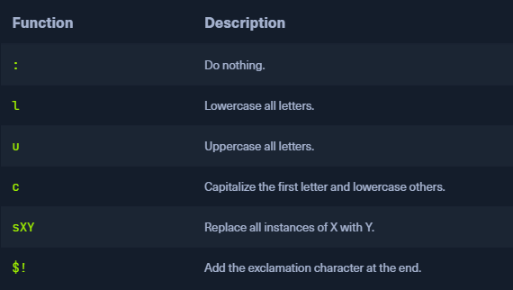

* Many people create their passwords according to `simplicity instead of security`
* Password policies can be created on all systems that determine how a password should look
* Passwords are often created closely related to the service used
* Often company name in password, also a person's preferences and interests play a significant role
	* Pets, friends, sports, hobbies, and many other elements of life
* `OSINT` information gathering can be very helpful for finding out more about a user's preferences and may assist with password guessing
* Most password lengths are `not longer` than `ten` characters

#### Password List

```sh
cat password.list

password
```

* Hashcat uses special [chars](https://hashcat.net/wiki/doku.php?id=rule_based_attack) for rules

 

* Each rule is written on a new line which determines how the word should be mutated

```sh
cat custom.rule

:
c
so0
c so0
sa@
c sa@
c sa@ so0
$!
$! c
$! so0
$! sa@
$! c so0
$! c sa@
$! so0 sa@
$! c so0 sa@
```

```sh
hashcat --force password.list -r custom.rule --stdout | sort -u > mut_password.list
cat mut_password.list

password
Password
passw0rd
Passw0rd
p@ssword
P@ssword
P@ssw0rd
password!
Password!
passw0rd!
p@ssword!
Passw0rd!
P@ssword!
p@ssw0rd!
P@ssw0rd!
```

* Hashcat and John come with pre-built rule list, one of the best is `best64.rule`

```sh
ls /usr/share/hashcat/rules/

best64.rule                  specific.rule
combinator.rule              T0XlC-insert_00-99_1950-2050_toprules_0_F.rule
d3ad0ne.rule                 T0XlC-insert_space_and_special_0_F.rule
dive.rule                    T0XlC-insert_top_100_passwords_1_G.rule
generated2.rule              T0XlC.rule
generated.rule               T0XlCv1.rule
hybrid                       toggles1.rule
Incisive-leetspeak.rule      toggles2.rule
InsidePro-HashManager.rule   toggles3.rule
InsidePro-PasswordsPro.rule  toggles4.rule
leetspeak.rule               toggles5.rule
oscommerce.rule              unix-ninja-leetspeak.rule
rockyou-30000.rule
```

* We can now use another tool called [CeWL](https://github.com/digininja/CeWL) to scan potential words from the company's website and save them in a separate list
*  We specify some parameters, like the depth to spider (`-d`), the minimum length of the word (`-m`), the storage of the found words in lowercase (`--lowercase`), as well as the file where we want to store the results (`-w`)

```sh
cewl https://www.inlanefreight.com -d 4 -m 6 --lowercase -w inlane.wordlist
wc -l inlane.wordlist

326
```