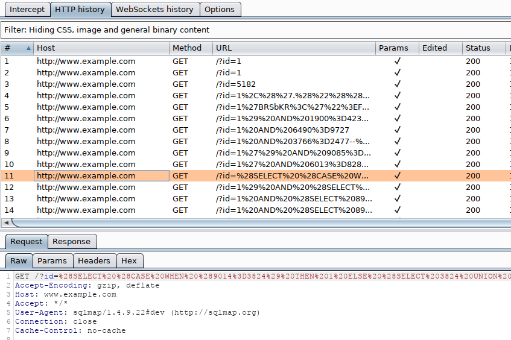

## Display Errors
* Switch the `--parse-errors`, to parse the DBMS errors (if any) and displays them as part of the program run
* With this option, SQLMap will automatically print the DBMS error, thus giving us clarity on what the issue may be so that we can properly fix it

```sh
...SNIP...
[16:09:20] [INFO] testing if GET parameter 'id' is dynamic
[16:09:20] [INFO] GET parameter 'id' appears to be dynamic
[16:09:20] [WARNING] parsed DBMS error message: 'SQLSTATE[42000]: Syntax error or access violation: 1064 You have an error in your SQL syntax; check the manual that corresponds to your MySQL server version for the right syntax to use near '))"',),)((' at line 1'"
[16:09:20] [INFO] heuristic (basic) test shows that GET parameter 'id' might be injectable (possible DBMS: 'MySQL')
[16:09:20] [WARNING] parsed DBMS error message: 'SQLSTATE[42000]: Syntax error or access violation: 1064 You have an error in your SQL syntax; check the manual that corresponds to your MySQL server version for the right syntax to use near ''YzDZJELylInm' at line 1'
...SNIP...
```

## Store the Traffic
* `-t` option stores the whole traffic content to an output file

```sh
$ sqlmap -u "http://www.target.com/vuln.php?id=1" --batch -t /tmp/traffic.txt
$ cat /tmp/traffic.txt

HTTP request [#1]:
GET /?id=1 HTTP/1.1
Host: www.example.com
Cache-control: no-cache
Accept-encoding: gzip,deflate
Accept: */*
User-agent: sqlmap/1.4.9 (http://sqlmap.org)
Connection: close

HTTP response [#1] (200 OK):
Date: Thu, 24 Sep 2020 14:12:50 GMT
Server: Apache/2.4.41 (Ubuntu)
Vary: Accept-Encoding
Content-Encoding: gzip
Content-Length: 914
Connection: close
Content-Type: text/html; charset=UTF-8
URI: http://www.example.com:80/?id=1

<!DOCTYPE html>
<html lang="en">
...SNIP...
```

## Verbose Output
* Another useful flag is the `-v` option, which raises the verbosity level of the console output

```sh
$ sqlmap -u "http://www.target.com/vuln.php?id=1" -v 6 --batch
        ___
       __H__
 ___ ___[,]_____ ___ ___  {1.4.9}
|_ -| . [(]     | .'| . |
|___|_  [(]_|_|_|__,|  _|
      |_|V...       |_|   http://sqlmap.org


[*] starting @ 16:17:40 /2020-09-24/

[16:17:40] [DEBUG] cleaning up configuration parameters
[16:17:40] [DEBUG] setting the HTTP timeout
[16:17:40] [DEBUG] setting the HTTP User-Agent header
[16:17:40] [DEBUG] creating HTTP requests opener object
[16:17:40] [DEBUG] resolving hostname 'www.example.com'
[16:17:40] [INFO] testing connection to the target URL
[16:17:40] [TRAFFIC OUT] HTTP request [#1]:
GET /?id=1 HTTP/1.1
Host: www.example.com
Cache-control: no-cache
Accept-encoding: gzip,deflate
Accept: */*
User-agent: sqlmap/1.4.9 (http://sqlmap.org)
Connection: close

[16:17:40] [DEBUG] declared web page charset 'utf-8'
[16:17:40] [TRAFFIC IN] HTTP response [#1] (200 OK):
Date: Thu, 24 Sep 2020 14:17:40 GMT
Server: Apache/2.4.41 (Ubuntu)
Vary: Accept-Encoding
Content-Encoding: gzip
Content-Length: 914
Connection: close
Content-Type: text/html; charset=UTF-8
URI: http://www.example.com:80/?id=1

<!DOCTYPE html>
<html lang="en">

<head>
  <meta charset="utf-8">
  <meta name="viewport" content="width=device-width, initial-scale=1, shrink-to-fit=no">
  <meta name="description" content="">
  <meta name="author" content="">
  <link href="vendor/bootstrap/css/bootstrap.min.css" rel="stylesheet">
  <title>SQLMap Essentials - Case1</title>
</head>

<body>
...SNIP...
```

## Using Proxy
*  Utilize the `--proxy` (proxychains) option to redirect the whole traffic through a (MiTM) proxy (e.g., `Burp`) 
* So that we can later manually investigate all requests, repeat them



