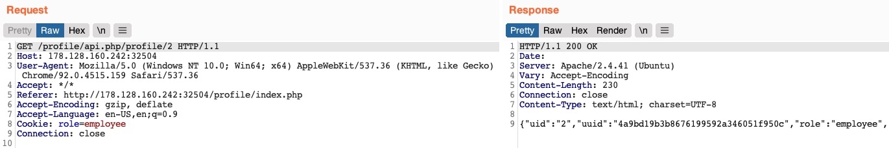

## Information Disclosure
* Let's send a `GET` request with another `uid`



* This returned the details of another user, with their own `uuid` and `role`, confirming an `IDOR Information Disclosure vulnerability`

```json
{
    "uid": "2",
    "uuid": "4a9bd19b3b8676199592a346051f950c",
    "role": "employee",
    "full_name": "Iona Franklyn",
    "email": "i_franklyn@employees.htb",
    "about": "It takes 20 years to build a reputation and few minutes of cyber-incident to ruin it."
}
```

## Modifying Other Users' Details
* With the `uuid` we can now change the user's details
* Another potential attack is `placing an XSS payload in the 'about' field`